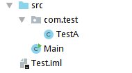
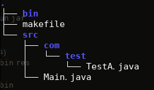
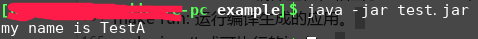

# 第二节

## 背景
因为一些场景，需要使用Makefile构建java，常见的makefile都是用来编译c/c++，而用来编译java的则很多了，比如ant、maven、gradle等，  
很少用makefile来管理构建java。  
如下，在搜索相关资料的过程中，有个评语很有代表性：  
  


## 正文
### 工程结构
以正文简单的java工程为例来浅尝下makefile编译java。  
工程结构如下：  
 


|── src  
      |── Main.java  
      |── com  
            |──test  
                 |── B.java  

代码：   

```java
import com.test.TestA;

public class Main
{
    public static void main (String[] args)
    {
        TestA testA = new TestA();
        testA.printName();
    }
}
```
```java
package com.test;

public class TestA {
    public void printName() {
        System.out.println("my name is TestA");
    }
}
```


### makefile文件
根据上面的工程，编写的makefile内容如下：  

```makefile
# 设置生成的jar包的文件名
JAR_PKG = test.jar

# 设置jar包的入口点
ENTRY_POINT = Main

# 是否需要res目录，如果程序有图片、文档等，
# 最好放入res目录中。
# yes: 需要；no：不需要
RES_DIR = no

SOURCE_FILES = \
com/test/TestA.java\
Main.java 

# 设置你的java编译器
JAVAC = javac
# 设置你的编译选项
JFLAGS = -encoding UTF-8 

# 用法：
# make new: 在你的工程目录下生成src, bin, res子目录。
# make build: 编译，在bin目录下生成 java classes。
# make clean: 清理编译结果，以便重新编译
# make rebuild: 清理编译结果，重新编译。
# make run: make 之后，可以通过make run查看运行结果。
# make jar: 生成可执行的jar包。

vpath %.class bin
vpath %.java src

# show help message by default
Default:
	@echo "make new: new project, create src, bin, res dirs."
	@echo "make build: build project."
	@echo "make clean: clear classes generated."
	@echo "make rebuild: rebuild project."
	@echo "make run: run your app."
	@echo "make jar: package your project into a executable jar."

build: $(SOURCE_FILES:.java=.class)

# pattern rule
# 不能处理两个类互相引用的情况，尽量避免
%.class: %.java
	$(JAVAC) -cp bin -d bin $(JFLAGS) $<

rebuild: clean build

.PHONY: new clean run jar

new:
ifeq ($(RES_DIR),yes)
	mkdir -pv src bin res
else
	mkdir -pv src bin
endif

clean:
	rm -frv bin/*

run:
	java -cp bin $(ENTRY_POINT)

jar:
ifeq ($(RES_DIR),yes)
	jar cvfe $(JAR_PKG) $(ENTRY_POINT)  -C bin . res
else
	jar cvfe $(JAR_PKG) $(ENTRY_POINT) -C bin .
endif

all: new build jar 

```

### makefile用法解析

#### 编译工程目录
将此makefile放入你的工程目录，确保文件名是 makefile 或 Makefile 。  
编译工程目录如下：  


```
[xxx@xxx-pc example]$ tree  -AC
.
├── bin
├── makefile  
└── src  
    ├── com  
    │   └── test  
    │       └── TestA.java  
    └── Main.java  

4 directories, 3 files  
```

#### 命令

* 1. JAR_PKG: 如果最后要打成jar包的名称。  
* 2. ENTRY_POINT: 程序执行的入口类  
* 3. RES_DIR: yes或no，如果创建工程时需要创建res目录存放图片等资源，设置为yes。  
* 4. SOURCE_FILES: 这是最重要的，设置你要编译的源文件。如果你使用 了package，就在src目录中创建对应的目录层次，然后把源源文件放入对应的目录。这里设置的源文件应该包括包的目录层次。如你的类 com.game.A，对应的源文件是 src/com/game/A.java，那么在这里的 源文件名是 com/game/A.java，即src下的相对路径。  
如果A.java依赖B.java，则需要将B.java写在A的前面，否则会编译不通过，类似如下错误：  

```
[xxx@xxx-pc example]$ make build
javac -cp bin -d bin -encoding UTF-8  src/Main.java
src/Main.java:1: 错误: 程序包com.test不存在
import com.test.TestA;
               ^
src/Main.java:7: 错误: 找不到符号
        TestA testA = new TestA();
        ^
  符号:   类 TestA
  位置: 类 Main
src/Main.java:7: 错误: 找不到符号
        TestA testA = new TestA();
                          ^
  符号:   类 TestA
  位置: 类 Main
3 个错误
make: *** [makefile:72：Main.class] 错误 1

```

* 5. JAVAC: java编译器，如果你使用sun java，那这里是javac。也可以 填写你的java编译器的绝对路径。  
JFLAGS：填写你的编译选项，如果要调试加 -g ，如果文件中包含中文字符，可能要设置编码，如果文件编码是 UTF-8 ，选项中 要添加 -encoding UTF-8 。更多选项，查看 javac-help 。  
javac 编译选项：  
```
javac -help
用法: javac <options> <source files>
其中, 可能的选项包括:
  -g                         生成所有调试信息
  -g:none                    不生成任何调试信息
  -g:{lines,vars,source}     只生成某些调试信息
  -nowarn                    不生成任何警告
  -verbose                   输出有关编译器正在执行的操作的消息
  -deprecation               输出使用已过时的 API 的源位置
  -classpath <路径>            指定查找用户类文件和注释处理程序的位置
  -cp <路径>                   指定查找用户类文件和注释处理程序的位置
  -sourcepath <路径>           指定查找输入源文件的位置
  -bootclasspath <路径>        覆盖引导类文件的位置
  -extdirs <目录>              覆盖所安装扩展的位置
  -endorseddirs <目录>         覆盖签名的标准路径的位置
  -proc:{none,only}          控制是否执行注释处理和/或编译。
  -processor <class1>[,<class2>,<class3>...] 要运行的注释处理程序的名称; 绕过默认的搜索进程
  -processorpath <路径>        指定查找注释处理程序的位置
  -parameters                生成元数据以用于方法参数的反射
  -d <目录>                    指定放置生成的类文件的位置
  -s <目录>                    指定放置生成的源文件的位置
  -h <目录>                    指定放置生成的本机标头文件的位置
  -implicit:{none,class}     指定是否为隐式引用文件生成类文件
  -encoding <编码>             指定源文件使用的字符编码
  -source <发行版>              提供与指定发行版的源兼容性
  -target <发行版>              生成特定 VM 版本的类文件
  -profile <配置文件>            请确保使用的 API 在指定的配置文件中可用
  -version                   版本信息
  -help                      输出标准选项的提要
  -A关键字[=值]                  传递给注释处理程序的选项
  -X                         输出非标准选项的提要
  -J<标记>                     直接将 <标记> 传递给运行时系统
  -Werror                    出现警告时终止编译
  @<文件名>                     从文件读取选项和文件名
  ```

* 6. make new: 新建工程，在当前目录下生成src, bin, res（如果 RES_DIR = yes）子目录，类似Eclipse项目的目录层次。java源文件放 在src目录下，生成的class放在bin目录下。  

* 7. make build: 编译工程。  
```
make build
javac -cp bin -d bin -encoding UTF-8  src/com/test/TestA.java
javac -cp bin -d bin -encoding UTF-8  src/Main.java
```

make clean: 清除生成的class，以便重新编译。  
make rebuild: 重新编译工程，相当于make clean; make build。  
make run: 运行编译生成的应用。  
* 8. make jar: 生成可执行的jar包。  
```
make jar
jar cvfe test.jar Main -C bin .
已添加清单
正在添加: Main.class(输入 = 320) (输出 = 244)(压缩了 23%)
正在添加: com/(输入 = 0) (输出 = 0)(存储了 0%)
正在添加: com/test/(输入 = 0) (输出 = 0)(存储了 0%)
正在添加: com/test/TestA.class(输入 = 409) (输出 = 286)(压缩了 30%)
```
打包完毕，测试jar包是否可执行：  


make: 显示帮助信息。  
TODO:  
目前主要的缺陷是不能支持两个类互相引用的情况，如果两个类互相引用， 需要两个源文件同时编译，而这是makfile中的模式规则难支持的。  

现在的折中解决方案是：如果类A和类B互相引用，则把A.java 和B.java放在 SOURCE_FILES 列表的最前面。 并在模式规则后面附加 B.java，即：  

```makefile
%.class: %.java B.java
    $(JAVAC) -cp bin -d bin $(JFLAGS) $<
```


