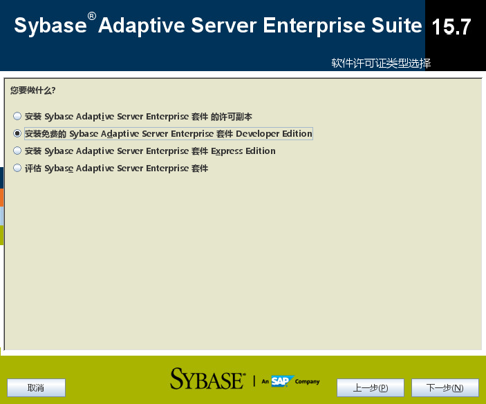
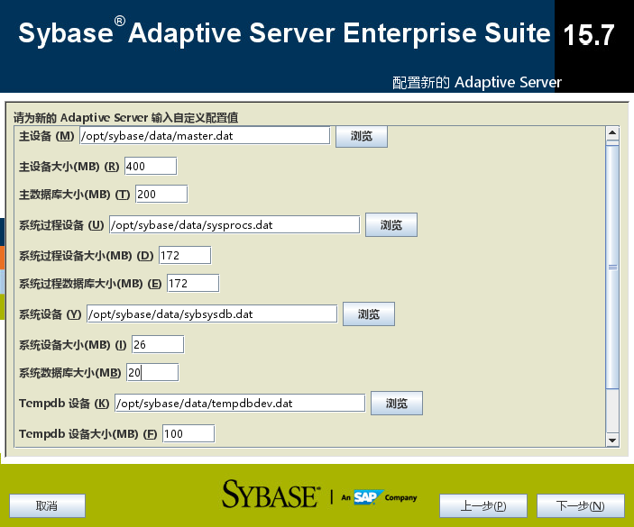

# sybase安装及启动日志
## 安装

SAP Sybase ASE 15.7支持三种安装方式："图形界面"方式安装、"文本界面"交互式安装和"静默"方式安装。下面简要说明这三种安装方式，并在随后详细说明静默方式安装方法。  
### 图形界面安装
#### 过程
1. 准备
创建目录：  

```shell
cd /opt
sudo mkdir sybase
sudo chown sybase:sybase sybase         将创建的sybase目录用户及组切换为sybase，不建议使用root用户及组


```
2. 开始安装
使用GUI界面进行交互式安装是安装ASE 15.7最简单的方法。在Linux上或Unix操作系统下，需要有X-Window环境才能使用这种方法。在使用图形界面方式安装时，我们可以把安装期间的交互式设置记录到响应文件中，以后就可以使用响应文件进行"静默"模式安装。下面是一个示例：  
```shell
./setup.bin -r /tmp/ase157_response.txt   # -r表示把安装过程记录到响应文件中.
```
  

  

  

  

  

开始安装：  
  
安装过程：  


  

  

  

  

  

  

  

  

  

  

  

  

#### 安装中的问题
1. Sybase Control Center 启动失败
官网介绍如下，确认不是自己需要的，暂时不关注该问题。
>
>SAP Control Center 是一款基于 Web 的工具，用于管理和监控 SAP Sybase 服务器，包括 SAP Sybase IQ 单节点服务器和 Multiplex 服务器。一台 SCC 服务器能够管理并监控 企业内的所有 SAP Sybase IQ 服务器。SCC 使用随每台 SAP Sybase IQ 服务器一起安 装的 SCC 代理执行管理任务。
>有关安装 SCC 的说明，请参见 SAP Sybase Control Center 安装指南。有关设置 SCC 代理以作为服务运行、启动和停止 SCC 代理服务以及从命令行运行 SCC 代理的说 明，请参见 SAP Control Center 联机帮助
>
 


2. 执行isql命令登录时报错
执行 `isql -Usa -SDBSVR -P******`时报错：  

```
The context allocation routine failed when it tried to load localization files!!  
One or more following problems may caused the failure  

Your sybase home directory is /opt/sybase. Check the environment variable SYBASE if it is not the one you want!  
Using locale name "zh_CN.utf8" defined in environment variable LANG  
Locale name "zh_CN.utf8" doesn't exist in your /opt/sybase/locales/locales.dat file  
An error occurred when attempting to allocate localization-related structures.  
```
解决办法：  
执行以下命令：  
**`export LANG=C`
**

#### 安装过程日志
开始安装时已指定安装过程的日志路径：/tmp/ase157_response.txt  
该文件记录了安装过程中的选项信息，具体参考：
[ase157_response.txt](_v_attachments/20190721221615472_352322543/ase157_response.txt)

----

### 文本界面交互式安装
  对于没有X-Window环境的情况，可以使用文本界面进行交互式安装。同样可以把安装期间的交互式设置记录到响应文件中。下面是一个示例：  
```shell
./setup.bin -i console -r /tmp/ase157_response.txt   # -r表示把安装过程记录到响应文件中.
```
### 使用响应文件安装
  ASE 15.7还提供了"静默"方式安装。这种方法在安装过程中无需人工交互，可以自动进行安装。  
在下面的内容中，我们就详细介绍"静默"方式安装：   

1. 执行如下命令解压安装软件包：
```shell
tar  xvfz  ase157_linuxx86-64.tgz  -C ./ase157    
```

2. 编辑响应文件
    在安装软件包成功解压之后，在程序目录下有一个名为sample_response.txt的示例响应文件。通过编辑这个文件，可以形成我们需要的安装响应文件。下面是这个示例文件中需要修改的配置项：  
>
>USER_INSTALL_DIR=/opt/sybase/ase157  
>SYBASE_PRODUCT_LICENSE_TYPE=evaluate  
>SYSAM_LICENSE_TYPE=EV :  Evaluation License    
>SY_CONFIG_ASE_SERVER=false  
>SY_CONFIG_BS_SERVER=false  
>SY_CONFIG_XP_SERVER=false  
>SY_CONFIG_JS_SERVER=false  
>SY_CONFIG_SM_SERVER=false  
>SY_CONFIG_SCC_SERVER=false  
>INSTALL_SCC_SERVICE=FALSE  
>AGREE_TO_SYBASE_LICENSE=true  
>
   
3. 运行安装程序，例如：
```shell
./setup.bin -i silent  -f /tmp/ase157_response.txt
```
4. 安装日志文件
  在安装过程中，ASE的安装程序会在ASE安装目标目录的log子目录下写日志文件。如果安装过程出现问题，可以查看这些日志文件以便寻找线索，其中最重要的一个日志文件是$SYBASE/log/ASE_Suite.log。  

----

## 卸载
```shell
$SYBASE/sybuninstall/ASESuite/uninstall
```
----

下载安装包， 解压到/opt/sybase，注意必须目录是这样的/opt/sybase/ASE-15_0/install/ ，因为RUN_DBSVR里面写死了/opt/sybase/ASE-15_0/bin/dataserver  

## 启动日志
**日志路径：**  
sybase/ASE-15_0/install/DBSVR.log 　　

[DBSVR.log](_v_attachments/20190721221615472_352322543/DBSVR.log)


00:0000:00000:00000:2019/07/21 19:51:00.64 kernel  SySAM: Using licenses from: /opt/sybase/SYSAM-2_0/licenses/SYBASE_ASE_DE.lic  
00:0000:00000:00000:2019/07/21 19:51:00.67 kernel  SySAM: Checked out license for 4 ASE_CORE (2015.1231/permanent/12FE BE55 1B69 AE84).  
00:0000:00000:00000:2019/07/21 19:51:00.67 kernel  This product is licensed to: ASE Developer Edition - For Development and Test use only  
00:0000:00000:00000:2019/07/21 19:51:00.67 kernel  Checked out license ASE_CORE  
00:0000:00000:00000:2019/07/21 19:51:00.67 kernel  Adaptive Server Enterprise (Developer Edition)  
00:0000:00000:00000:2019/07/21 19:51:00.67 kernel  Performing space allocation for device '/opt/sybase/data/master.dat' (0.39 Gb).  This may take some time.  
00:0000:00000:00000:2019/07/21 19:51:00.74 kernel  Finished initialization.  
00:0000:00000:00000:2019/07/21 19:51:00.74 kernel  Using config area from primary master device.  
00:0000:00000:00000:2019/07/21 19:51:00.74 server  Configuration Error: Configuration file, '/opt/sybase/DBSVR.cfg', does not exist.  
00:0000:00000:00000:2019/07/21 19:51:00.74 kernel  Warning: A configuration file was not specified or the default file '/opt/sybase/DBSVR.cfg' does not exist. ASE creates the default file.  
00:0000:00000:00000:2019/07/21 19:51:00.75 kernel  Warning: Using default file '/opt/sybase/DBSVR.cfg' since a configuration file was not specified. Specify a configuration file name in the RUNSERVER file to avoid this message.  
00:0000:00000:00000:2019/07/21 19:51:00.75 kernel  Could not allocate memory using Huge Pages. Allocated using regular pages. For better performance, reboot the server after configuring enough Huge Pages.  
00:0000:00000:00000:2019/07/21 19:51:00.75 kernel  Internal run-time model set for Linux  - Native  
00:0000:00000:00000:2019/07/21 19:51:00.75 kernel  Adaptive Server is using the threaded kernel mode.  
00:0000:00000:00000:2019/07/21 19:51:00.75 kernel  Using 40000 file descriptors.  
00:0000:00000:00000:2019/07/21 19:51:00.75 kernel  Adaptive Server Enterprise/15.7/EBF 21341 SMP SP101 /P/x86_64/Enterprise Linux/ase157sp101/3439/64-bit/FBO/Thu Jun  6 16:08:18 2013  **`数据库版本信息`**  
00:0000:00000:00000:2019/07/21 19:51:00.75 kernel  Confidential property of Sybase, Inc.  
00:0000:00000:00000:2019/07/21 19:51:00.75 kernel  Copyright 1987, 2013  
00:0000:00000:00000:2019/07/21 19:51:00.75 kernel  Sybase, Inc.  All rights reserved.  
00:0000:00000:00000:2019/07/21 19:51:00.75 kernel  Unpublished rights reserved under U.S. copyright laws.  
00:0000:00000:00000:2019/07/21 19:51:00.75 kernel  
00:0000:00000:00000:2019/07/21 19:51:00.75 kernel  This software contains confidential and trade secret information of Sybase,  
00:0000:00000:00000:2019/07/21 19:51:00.75 kernel  Inc.   Use,  duplication or disclosure of the software and documentation by  
00:0000:00000:00000:2019/07/21 19:51:00.75 kernel  the  U.S.  Government  is  subject  to  restrictions set forth in a license  
00:0000:00000:00000:2019/07/21 19:51:00.75 kernel  agreement  between  the  Government  and  Sybase,  Inc.  or  other  written  
00:0000:00000:00000:2019/07/21 19:51:00.75 kernel  agreement  specifying  the  Government's rights to use the software and any  
00:0000:00000:00000:2019/07/21 19:51:00.75 kernel  applicable FAR provisions, for example, FAR 52.227-19.  
00:0000:00000:00000:2019/07/21 19:51:00.75 kernel  Sybase, Inc. One Sybase Drive, Dublin, CA 94568, USA  
00:0000:00000:00000:2019/07/21 19:51:00.75 kernel  Using /opt/sybase as the 'SYBASE' environment variable, found during startup.  
00:0000:00000:00000:2019/07/21 19:51:00.75 kernel  Using OCS-15_0 as the 'SYBASE_OCS' environment variable, found during startup.  
00:0000:00000:00000:2019/07/21 19:51:00.75 kernel  Using ASE-15_0 as the 'SYBASE_ASE' environment variable, found during startup.  
00:0000:00000:00000:2019/07/21 19:51:00.75 kernel  ASE booted on host 'huajingze-pc' running Linux release 4.14.133-1-MANJARO version #1 SMP PREEMPT Wed Jul 10 16:46:07 UTC 2019.   
00:0000:00000:00000:2019/07/21 19:51:00.75 kernel  Using '/opt/sybase/DBSVR.cfg' for configuration information.  **`使用DBSVR.cfg作为数据库服务器的配置文件，如果配置文件有文件可能　导致数据库启动失败`**　　
00:0000:00000:00000:2019/07/21 19:51:00.75 kernel  Logging ASE messages in file '/opt/sybase/ASE-15_0/install/DBSVR.log'.  **`数据库日志记录在DBSVR.log中`**  
00:0000:00000:00000:2019/07/21 19:51:00.75 kernel  Disk Controller Manager is online.  
00:0000:00000:00000:2019/07/21 19:51:00.75 kernel  Network Controller Manager is online.  
00:0000:00000:00000:2019/07/21 19:51:00.75 kernel  Ct-Lib Controller Manager is online.  
00:0000:00000:00000:2019/07/21 19:51:00.75 kernel  Platform TCP network support seems IPv6-aware, IPv4/IPv6 are both enabled.  
00:0000:00000:00000:2019/07/21 19:51:00.75 kernel  ASE booted with TCP_NODELAY enabled.  
00:0000:00000:00000:2019/07/21 19:51:00.75 kernel  Network and device connection limit is 39985.  
00:0000:00000:00000:2019/07/21 19:51:00.75 kernel  ASE - Dynamic Pluggable Component Interface is disabled  
00:0000:00000:00000:2019/07/21 19:51:00.76 kernel  Adaptive Server is running as process id 32030.  
00:0000:00000:00000:2019/07/21 19:51:00.77 server  Number of blocks left for proc headers: 6920.  
00:0000:00000:00000:2019/07/21 19:51:00.77 server  Proc header memory allocated 1384 pages for each per engine cache.  
00:0000:00000:00000:2019/07/21 19:51:00.78 server  Proc header memory allocated 1384 pages for engine 0 local cache  
00:0000:00000:00000:2019/07/21 19:51:00.78 kernel  Using value of 'number of engines at startup' (1) for size of syb_default_pool.  
00:0000:00000:00000:2019/07/21 19:51:00.78 kernel  Create Thread Pool 3, "syb_blocking_pool", type="Run To Completion", with 4 threads  
00:0000:00000:00000:2019/07/21 19:51:00.78 kernel  Create Thread Pool 2, "syb_system_pool", type="Run To Completion", with 1 threads    
00:0000:00000:00000:2019/07/21 19:51:00.78 kernel  Create Thread Pool 1, "syb_default_pool", type="Engine (Multiplexed)", with 1 threads  
00:0000:00000:00000:2019/07/21 19:51:00.78 kernel  Aggressive task stealing enabled  
00:0000:00000:00000:2019/07/21 19:51:00.78 kernel  Enabling Linux Native Kernel asynchronous disk I/O strategy.  
00:0007:00000:00000:2019/07/21 19:51:00.78 kernel  I/O controller 2 (NetController) is running as task 1128226816 on thread 7 (LWP 32042).  
00:0000:00000:00000:2019/07/21 19:51:00.78 kernel  Initializing virtual device 0, '/opt/sybase/data/master.dat' with dsync 'off'.
**`开始初始化master数据库的设备，一般设备号是0的，表示是master的设备，单引号中表示设备的路径，这个例子中表示设备是建立在文件系统上的，如果是建立在裸分区上的，则会是类似这样的：'/dev/rdsk/c1t1d0s3'`**  
00:0000:00000:00000:2019/07/21 19:51:00.78 kernel  Virtual device 0 started using asynchronous i/o.  
00:0000:00000:00000:2019/07/21 19:51:00.78 server  Loaded default Unilib conversion handle.  
00:0008:00000:00000:2019/07/21 19:51:00.78 kernel  I/O controller 3 (DiskController) is running as task 1128227536 on thread 8 (LWP 32043).  
00:0000:00000:00000:2019/07/21 19:51:00.78 kernel  Worker Thread Manager is not enabled for use in ASE.  
00:0000:00000:00000:2019/07/21 19:51:00.78 kernel  Either the config parameter 'use security services' is set to 0, or ASE does not support use of external security mechanisms on this platform. The Security Control Layer will not be initialized. No external security mechanisms will be supported.  
00:0000:00000:00000:2019/07/21 19:51:00.78 kernel  libsybibmmq - Sybase IBM MQ interface/15.7/EBF 21341 SMP SP101 /P/x86_64/Enterprise Linux/ase157sp101/3439/64-bit/OPT/Thu Jun  6 12:02:54 2013  
00:0000:00000:00000:2019/07/21 19:51:00.79 kernel  Loaded encryption provider CSI-2.8M2-linuxamd64-2012/12/27 21:15:59 PST-sybcsi_openssl-OpenSSL 1.0.1b 26 Apr 2012.  
00:0000:00000:00000:2019/07/21 19:51:00.79 kernel  Begin processing to generate RSA keypair.  
00:0000:00000:00000:2019/07/21 19:51:00.82 kernel  Completed processing to generate RSA keypair.  
00:0000:00000:00000:2019/07/21 19:51:00.82 kernel  Begin processing to generate RSA keypair.  
00:0000:00000:00000:2019/07/21 19:51:00.83 kernel  Completed processing to generate RSA keypair.  
00:0000:00000:00000:2019/07/21 19:51:00.83 kernel  Encryption provider initialization succeeded on engine 0.  
00:0000:00000:00000:2019/07/21 19:51:00.83 kernel  SSL Plus v5.2.2 security modules loaded successfully.  
00:0006:00000:00000:2019/07/21 19:51:00.83 kernel  Network and device connection limit is 39985.  
00:0006:00000:00000:2019/07/21 19:51:00.83 kernel  ASE - Dynamic Pluggable Component Interface is disabled  
00:0006:00000:00000:2019/07/21 19:51:00.83 kernel  Thread 6 (LWP 32036) of Threadpool syb_default_pool online as engine 0  
00:0006:00000:00000:2019/07/21 19:51:00.83 server  Active traceflags: 1623  
00:0006:00000:00001:2019/07/21 19:51:00.83 kernel  libomni1 - Component Integration Services: using 'Sybase Client-Library/15.7/P-EBF21002 SP100/DRV.15.7.0.10/Linux x86_64/Linux 2.6.18-128.el5 x86_64 Native Threads/BUILD1570-026/64bit/OPT/Wed Mar 20 21:34:36 2013'  
00:0006:00000:00001:2019/07/21 19:51:00.83 server  Size of the 4K memory pool: 8192 Kb  
00:0006:00000:00001:2019/07/21 19:51:00.83 server  The logical pagesize of the server is 4 Kb.  
00:0006:00000:00001:2019/07/21 19:51:00.83 server  Database 'master' does not exist. ASE will create it.  
00:0006:00000:00001:2019/07/21 19:51:00.83 server  Database 'master': beginning upgrade step [ID     1]: Initialize disk and create empty allocation units on master device.   
00:0006:00000:00001:2019/07/21 19:51:00.84 server  Database 'master': beginning upgrade step [ID     2]: Bootstrap basic system catalogs in database.   
00:0006:00000:00001:2019/07/21 19:51:00.84 server  Database 'master': beginning upgrade step [ID     6]: creating index (table syspartitions, index ncsyspartitions)  
00:0006:00000:00001:2019/07/21 19:51:00.85 server  Database 'master': beginning upgrade step [ID     8]: creating index (table systypes, index ncsystypes)  
00:0006:00000:00001:2019/07/21 19:51:00.85 server  Database 'master': beginning upgrade step [ID    10]: creating index (table sysobjects, index ncsysobjects)  
00:0006:00000:00001:2019/07/21 19:51:00.85 server  Database 'master': beginning upgrade step [ID    13]: creating table (table systabstats)  
00:0006:00000:00001:2019/07/21 19:51:00.85 server  Database 'master': beginning upgrade step [ID    20]: creating table (table sysusages)  
00:0006:00000:00001:2019/07/21 19:51:00.85 server  Database 'master': beginning upgrade step [ID    21]: creating table (table sysdatabases)  
00:0006:00000:00001:2019/07/21 19:51:00.85 server  Database 'master': beginning upgrade step [ID    22]: creating table (table sysdevices)  
00:0006:00000:00001:2019/07/21 19:51:00.85 server  Database 'master': beginning upgrade step [ID    23]: creating table (table sysmessages)  
00:0006:00000:00001:2019/07/21 19:51:00.86 server  Database 'master': beginning upgrade step [ID    24]: creating table (table sysconfigures)  
00:0006:00000:00001:2019/07/21 19:51:00.86 server  Database 'master': beginning upgrade step [ID    25]: creating table (table syscharsets)  
00:0006:00000:00001:2019/07/21 19:51:00.86 server  Database 'master': beginning upgrade step [ID    26]: creating table (table sysprocedures)  
00:0006:00000:00001:2019/07/21 19:51:00.86 server  Database 'master': beginning upgrade step [ID    27]: creating table (table syscomments)  
00:0006:00000:00001:2019/07/21 19:51:00.86 server  Database 'master': beginning upgrade step [ID    28]: creating table (table syssegments)  
00:0006:00000:00001:2019/07/21 19:51:00.86 server  Database 'master': beginning upgrade step [ID    29]: creating table (table sysprotects)    
00:0006:00000:00001:2019/07/21 19:51:00.87 server  Database 'master': beginning upgrade step [ID    30]: creating table (table sysusers)  
00:0006:00000:00001:2019/07/21 19:51:00.87 server  Database 'master': beginning upgrade step [ID    31]: creating table (table sysalternates)  
00:0006:00000:00001:2019/07/21 19:51:00.87 server  Database 'master': beginning upgrade step [ID    32]: creating table (table sysdepends)  
00:0006:00000:00001:2019/07/21 19:51:00.87 server  Database 'master': beginning upgrade step [ID    33]: creating table (table syskeys)  
00:0006:00000:00001:2019/07/21 19:51:00.87 server  Database 'master': beginning upgrade step [ID    35]: creating table (table sysprocesses)  
00:0006:00000:00001:2019/07/21 19:51:00.87 server  Database 'master': beginning upgrade step [ID    36]: creating table (table syslogins)  
00:0006:00000:00001:2019/07/21 19:51:00.88 server  Database 'master': beginning upgrade step [ID    37]: creating table (table syslocks)  
00:0006:00000:00001:2019/07/21 19:51:00.88 server  Database 'master': beginning upgrade step [ID    38]: creating table (table syscurconfigs)  
00:0006:00000:00001:2019/07/21 19:51:00.88 server  Database 'master': beginning upgrade step [ID    39]: creating table (table sysservers)  
00:0006:00000:00001:2019/07/21 19:51:00.88 server  Database 'master': beginning upgrade step [ID    40]: creating table (table sysremotelogins)  
00:0006:00000:00001:2019/07/21 19:51:00.88 server  Database 'master': beginning upgrade step [ID    41]: creating table (table sysmonitors)  
00:0006:00000:00001:2019/07/21 19:51:00.88 server  Database 'master': beginning upgrade step [ID    42]: creating table (table sysengines)  
00:0006:00000:00001:2019/07/21 19:51:00.88 server  Database 'master': beginning upgrade step [ID    43]: creating table (table syslanguages)  
00:0006:00000:00001:2019/07/21 19:51:00.88 server  Database 'master': beginning upgrade step [ID    44]: creating table (table systestlog)  
00:0006:00000:00001:2019/07/21 19:51:00.88 server  Database 'master': beginning upgrade step [ID    45]: creating table (table syssrvroles)  
00:0006:00000:00001:2019/07/21 19:51:00.88 server  Database 'master': beginning upgrade step [ID    46]: creating table (table sysloginroles)  
00:0006:00000:00001:2019/07/21 19:51:00.89 server  Database 'master': beginning upgrade step [ID    47]: creating table (table syspartitionkeys)  
00:0006:00000:00001:2019/07/21 19:51:00.89 server  Database 'master': beginning upgrade step [ID    48]: creating table (table syslogshold)  
00:0006:00000:00001:2019/07/21 19:51:00.89 server  Database 'master': beginning upgrade step [ID    49]: creating table (table syslisteners)  
00:0006:00000:00001:2019/07/21 19:51:00.89 server  Database 'master': beginning upgrade step [ID    50]: creating table (table syssecmechs)  
00:0006:00000:00001:2019/07/21 19:51:00.89 server  Database 'master': beginning upgrade step [ID    51]: creating table (table sysreferences)  
00:0006:00000:00001:2019/07/21 19:51:00.89 server  Database 'master': beginning upgrade step [ID    52]: creating table (table sysconstraints)  
00:0006:00000:00001:2019/07/21 19:51:00.89 server  Database 'master': beginning upgrade step [ID    53]: creating table (table sysusermessages)  
00:0006:00000:00001:2019/07/21 19:51:00.90 server  Database 'master': beginning upgrade step [ID    54]: creating table (table systhresholds)  
00:0006:00000:00001:2019/07/21 19:51:00.90 server  Database 'master': beginning upgrade step [ID    55]: creating table (table sysroles)  
00:0006:00000:00001:2019/07/21 19:51:00.90 server  Database 'master': beginning upgrade step [ID    56]: creating table (table sysslices)  
00:0006:00000:00001:2019/07/21 19:51:00.90 server  Database 'master': beginning upgrade step [ID    57]: creating table (table systimeranges)  
00:0006:00000:00001:2019/07/21 19:51:00.90 server  Database 'master': beginning upgrade step [ID    58]: creating table (table sysresourcelimits)  
00:0006:00000:00001:2019/07/21 19:51:00.90 server  Database 'master': beginning upgrade step [ID    60]: creating table (table sysstatistics)  
00:0006:00000:00001:2019/07/21 19:51:00.90 server  Database 'master': beginning upgrade step [ID    61]: creating table (table sysxtypes)  
00:0006:00000:00001:2019/07/21 19:51:00.91 server  Database 'master': beginning upgrade step [ID    62]: creating table (table sysjars)  
00:0006:00000:00001:2019/07/21 19:51:00.91 server  Database 'master': beginning upgrade step [ID    63]: creating table (table systransactions)  
00:0006:00000:00001:2019/07/21 19:51:00.91 server  Database 'master': beginning upgrade step [ID    65]: creating table (table sysqueryplans)  
00:0006:00000:00001:2019/07/21 19:51:00.91 server  Database 'master': beginning upgrade step [ID    66]: creating table (table syssessions)  
00:0006:00000:00001:2019/07/21 19:51:00.91 server  Database 'master': beginning upgrade step [ID    67]: creating table (table syscertificates)  
00:0006:00000:00001:2019/07/21 19:51:00.91 server  Database 'master': beginning upgrade step [ID    68]: creating table (table sysencryptkeys)  
00:0006:00000:00001:2019/07/21 19:51:00.92 server  Database 'master': beginning upgrade step [ID    71]: creating table (table sysoptions)  
00:0006:00000:00001:2019/07/21 19:51:00.92 server  Database 'master': beginning upgrade step [ID    73]: executing SQL statement ("update sysobjects set sysstat = sys...")  
00:0006:00000:00001:2019/07/21 19:51:00.92 server  Database 'master': beginning upgrade step [ID    74]: executing SQL statement ("update syscolumns set type=66, user...")  
00:0006:00000:00001:2019/07/21 19:51:00.92 server  Database 'master': beginning upgrade step [ID    80]: creating table (table sysattributes)  
00:0006:00000:00001:2019/07/21 19:51:00.92 server  Database 'master': beginning upgrade step [ID    81]: Load initial set of attribute-definition rows into SYSATTRIBUTES.   
00:0006:00000:00001:2019/07/21 19:51:01.21 server  Database 'master': beginning upgrade step [ID    82]: creating table (table sysdams)  
00:0006:00000:00001:2019/07/21 19:51:01.21 server  Database 'master': beginning upgrade step [ID    90]: insert basic data into bootstrap system tables   
00:0006:00000:00001:2019/07/21 19:51:01.31 server  Database 'master': beginning upgrade step [ID    91]: executing SQL statement ("update systypes set length=@@maxpag  ...")
00:0006:00000:00001:2019/07/21 19:51:01.31 server  Database 'master': beginning upgrade step [ID   245]: Update system roles in system tables.   
00:0006:00000:00001:2019/07/21 19:51:01.34 server  Database 'master': beginning upgrade step [ID   248]: update system catalog protection data   
00:0006:00000:00001:2019/07/21 19:51:01.35 server  Database 'master': beginning upgrade step [ID   606]: executing SQL statement ("select lct_admin('lastchance', db_i...")  
00:0006:00000:00001:2019/07/21 19:51:01.35 server  Database 'master': beginning upgrade step [ID  1026]: executing SQL statement ("if not exists (select 1 from systim...")  
00:0006:00000:00001:2019/07/21 19:51:01.35 server  Database 'master': beginning upgrade step [ID  1082]: executing SQL statement ("if not exists (select 1 from sysatt...")  
00:0006:00000:00001:2019/07/21 19:51:01.35 server  Database 'master': beginning upgrade step [ID  1126]: Initialize systabstats with valid statistics   
00:0006:00000:00001:2019/07/21 19:51:01.35 server  Database 'master': beginning upgrade step [ID  1131]: Creating/Updating the last chance threshold for logsegment.   
00:0006:00000:00001:2019/07/21 19:51:01.35 server  Database 'master': beginning upgrade step [ID  1213]: executing SQL statement ("update sysobjects set sysstat2 = sy...")  
00:0006:00000:00001:2019/07/21 19:51:01.35 server  Database 'master': beginning upgrade step [ID  1214]: executing SQL statement ("if not exists (select 1 from syssrv...")  
00:0006:00000:00001:2019/07/21 19:51:01.35 server  Database 'master': beginning upgrade step [ID  1274]: executing SQL statement ("declare @dummy int")  
00:0006:00000:00001:2019/07/21 19:51:01.35 server  Database 'master': beginning upgrade step [ID  1226]: executing SQL statement ("insert sysattributes (class, attrib...")  
00:0006:00000:00001:2019/07/21 19:51:01.35 server  Database 'master': beginning upgrade step [ID  1241]: executing SQL statement ("insert into sysattributes (class, a...")  
00:0006:00000:00001:2019/07/21 19:51:01.35 server  Database 'master': beginning upgrade step [ID  1245]: executing SQL statement ("if not exists (select 1 from syssrv...")    
00:0006:00000:00001:2019/07/21 19:51:01.35 server  Database 'master': beginning upgrade step [ID  1249]: executing SQL statement ("if (select suser_id('sa')) is not n...")  
00:0006:00000:00001:2019/07/21 19:51:01.36 server  Database 'master': beginning upgrade step [ID  1338]: executing SQL statement ("delete from sysconfigures where con..."  )
00:0006:00000:00001:2019/07/21 19:51:01.36 server  Database 'master': beginning upgrade step [ID  1344]: executing SQL statement ("if not exists (select 1 from sysatt...")  
00:0006:00000:00001:2019/07/21 19:51:01.36 server  Database 'master': beginning upgrade step [ID  1345]: executing SQL statement ("if not exists (select 1 from sysatt...")  
00:0006:00000:00001:2019/07/21 19:51:01.36 server  Database 'master': beginning upgrade step [ID  1348]: executing SQL statement ("if not exists (select 1 from sysatt...")  
00:0006:00000:00001:2019/07/21 19:51:01.36 server  Database 'master': beginning upgrade step [ID  1400]: noting the present database upgrade level   
00:0006:00000:00001:2019/07/21 19:51:01.36 server  Database 'master': beginning upgrade step [ID  1401]: Update syscharsets with Unicode sort orders.   
00:0006:00000:00001:2019/07/21 19:51:01.36 server  Database 'master': beginning upgrade step [ID  1409]: executing SQL statement ("if not exists (select 1 from syssrv...")  
00:0006:00000:00001:2019/07/21 19:51:01.36 server  Database 'master': beginning upgrade step [ID  1411]: executing SQL statement ("if not exists (select 1 from master...")  
00:0006:00000:00001:2019/07/21 19:51:01.36 server  Database 'master': beginning upgrade step [ID  1412]: executing SQL statement ("if not exists (select 1 from master...")  
00:0006:00000:00001:2019/07/21 19:51:01.36 server  Database 'master': beginning upgrade step [ID  1414]: executing SQL statement (" declare @srid int select @srid=rol...")  
00:0006:00000:00001:2019/07/21 19:51:01.37 server  Database 'master': beginning upgrade step [ID  1416]: executing SQL statement ("update sysroles set id=11 from sysu...")  
00:0006:00000:00001:2019/07/21 19:51:01.37 server  Database 'master': beginning upgrade step [ID  1417]: executing SQL statement ("update sysprotects set columns = 0x...")  
00:0006:00000:00001:2019/07/21 19:51:01.37 server  Database 'master': beginning upgrade step [ID  1421]: executing SQL statement ("update master.dbo.syslogins set sta...")  
00:0006:00000:00001:2019/07/21 19:51:01.37 server  Database 'master': beginning upgrade step [ID  1422]: executing SQL statement ("if not exists (select 1 from master...")  
00:0006:00000:00001:2019/07/21 19:51:01.37 server  Database 'master': beginning upgrade step [ID  1423]: executing SQL statement ("delete sysattributes where class=0...")  
00:0006:00000:00001:2019/07/21 19:51:01.37 server  Database 'master': beginning upgrade step [ID  1501]: executing SQL statement ("if not exists (select 1 from syscon...")  
00:0006:00000:00001:2019/07/21 19:51:01.37 server  Database 'master': beginning upgrade step [ID  1502]: executing SQL statement ("if exists (select 1 from sysobjects...")        
00:0006:00000:00001:2019/07/21 19:51:01.37 server  Database 'master': beginning upgrade step [ID  1503]: executing SQL statement ("create view sysquerymetrics (uid, g...")    
00:0006:00000:00001:2019/07/21 19:51:01.38 server  Database 'master': beginning upgrade step [ID  1505]: executing SQL statement ("update sysattributes set char_value...")  
00:0006:00000:00001:2019/07/21 19:51:01.38 server  Database 'master': beginning upgrade step [ID  1506]: executing SQL statement ("update sysattributes set int_value...")  
00:0006:00000:00001:2019/07/21 19:51:01.38 server  Database 'master': beginning upgrade step [ID  1507]: executing SQL statement ("update sysindexes set minlen = 22,...")  
00:0006:00000:00001:2019/07/21 19:51:01.38 server  Database 'master': beginning upgrade step [ID  1549]: executing SQL statement ("update sysattributes set char_value...")  
00:0006:00000:00001:2019/07/21 19:51:01.38 server  Database 'master': beginning upgrade step [ID  1550]: noting the present database upgrade level   
00:0006:00000:00001:2019/07/21 19:51:01.38 server  Database 'master': beginning upgrade step [ID  1551]: executing SQL statement ("if not exists (select 1 from syssrv...")  
00:0006:00000:00001:2019/07/21 19:51:01.38 server  Database 'master': beginning upgrade step [ID  1553]: executing SQL statement ("if not exists (select 1 from master...")  
00:0006:00000:00001:2019/07/21 19:51:01.38 server  Database 'master': beginning upgrade step [ID  1554]: upgrade simulated statistics   
00:0006:00000:00001:2019/07/21 19:51:01.39 server  Database 'master': beginning upgrade step [ID  1557]: executing SQL statement ("if not exists (select 1 from sysatt...")  
00:0006:00000:00001:2019/07/21 19:51:01.39 server  Database 'master': beginning upgrade step [ID  1558]: executing SQL statement ("delete sysattributes where class=0...")  
00:0006:00000:00001:2019/07/21 19:51:01.39 server  Database 'master': beginning upgrade step [ID  1559]: executing SQL statement ("update sysservers set srvstatus = s...")  
00:0006:00000:00001:2019/07/21 19:51:01.39 server  Database 'master': beginning upgrade step [ID  1560]: executing SQL statement ("delete from sysconfigures where con..."  )  
00:0006:00000:00001:2019/07/21 19:51:01.39 server  Database 'master': beginning upgrade step [ID  1564]: executing SQL statement ("declare @dbid int select @dbid = db..."  )  
00:0006:00000:00001:2019/07/21 19:51:01.39 server  Database 'master': beginning upgrade step [ID  1601]: executing SQL statement ("update sysservers set srvstatus2 =...")  
00:0006:00000:00001:2019/07/21 19:51:01.39 server  Database 'master': beginning upgrade step [ID  1620]: executing SQL statement ("update sysdatabases set durability...")  
00:0006:00000:00001:2019/07/21 19:51:01.39 server  Database 'master': beginning upgrade step [ID  1621]: executing SQL statement ("delete sysattributes where class=0...")  
00:0006:00000:00001:2019/07/21 19:51:01.40 server  Database 'master': beginning upgrade step [ID  1623]: executing SQL statement ("delete sysattributes where class =...")  
00:0006:00000:00001:2019/07/21 19:51:01.40 server  Database 'master': beginning upgrade step [ID  1624]: executing SQL statement ("declare @all int delete master.dbo....")  
00:0006:00000:00001:2019/07/21 19:51:01.40 server  Database 'master': beginning upgrade step [ID  1648]: Adding role sa_serverprivs_role 
00:0006:00000:00001:2019/07/21 19:51:01.40 server  Database 'master': beginning upgrade step [ID  1649]: executing SQL statement (" if exists (select role_id('sa_serv...")  
00:0006:00000:00001:2019/07/21 19:51:01.40 server  Database 'master': beginning upgrade step [ID  1650]: executing SQL statement ("dbcc upgd_grantrev_sysrole_perms('g...")  
00:0006:00000:00001:2019/07/21 19:51:01.53 server  Database 'master': beginning upgrade step [ID  1651]: updating builtin permissions 
00:0006:00000:00001:2019/07/21 19:51:01.53 server  Database 'master': beginning upgrade step [ID  1652]: adding generic user 'usedb_user' to sysusers 
00:0006:00000:00001:2019/07/21 19:51:01.53 server  Database 'master': beginning upgrade step [ID  1653]: updating DBCC command permissions 
00:0006:00000:00001:2019/07/21 19:51:01.53 server  Database 'master': beginning upgrade step [ID  1702]: noting the present database upgrade level 
00:0006:00000:00001:2019/07/21 19:51:01.53 server  Database 'master': beginning upgrade step [ID  1718]: executing SQL statement ("update master.dbo.sysusages set loc...")  
00:0006:00000:00001:2019/07/21 19:51:01.53 server  Database 'master': beginning upgrade step [ID  1719]: executing SQL statement ("update sysattributes set object_inf...")  
00:0006:00000:00001:2019/07/21 19:51:01.53 server  Database 'master': beginning upgrade step [ID  1720]: noting the present database upgrade level 
00:0006:00000:00001:2019/07/21 19:51:01.53 server  Database 'master': beginning upgrade step [ID  1730]: noting the present database upgrade level 
00:0006:00000:00001:2019/07/21 19:51:01.53 server  Database 'master': beginning upgrade step [ID  1731]: executing SQL statement ("begin declare @val int select @val=...")  
00:0006:00000:00001:2019/07/21 19:51:01.53 server  Database 'master': beginning upgrade step [ID  1740]: noting the present database upgrade level 
00:0006:00000:00001:2019/07/21 19:51:01.53 server  Database 'model' does not exist. ASE will create it.  
00:0006:00000:00001:2019/07/21 19:51:01.53 server  Database 'model': beginning upgrade step [ID     1]: Initialize disk and create empty allocation units on master device.   
00:0006:00000:00001:2019/07/21 19:51:01.53 server  Database 'model': beginning upgrade step [ID     2]: Bootstrap basic system catalogs in database.   
00:0006:00000:00001:2019/07/21 19:51:01.54 server  Database 'model': beginning upgrade step [ID     6]: creating index (table syspartitions, index ncsyspartitions)  
00:0006:00000:00001:2019/07/21 19:51:01.54 server  Database 'model': beginning upgrade step [ID     8]: creating index (table systypes, index ncsystypes)  
00:0006:00000:00001:2019/07/21 19:51:01.54 server  Database 'model': beginning upgrade step [ID    10]: creating index (table sysobjects, index ncsysobjects)  
00:0006:00000:00001:2019/07/21 19:51:01.54 server  Database 'model': beginning upgrade step [ID    13]: creating table (table systabstats)  
00:0006:00000:00001:2019/07/21 19:51:01.54 server  Database 'model': beginning upgrade step [ID    26]: creating table (table sysprocedures)  
00:0006:00000:00001:2019/07/21 19:51:01.54 server  Database 'model': beginning upgrade step [ID    27]: creating table (table syscomments)      
00:0006:00000:00001:2019/07/21 19:51:01.54 server  Database 'model': beginning upgrade step [ID    28]: creating table (table syssegments)  
00:0006:00000:00001:2019/07/21 19:51:01.54 server  Database 'model': beginning upgrade step [ID    29]: creating table (table sysprotects)  
00:0006:00000:00001:2019/07/21 19:51:01.55 server  Database 'model': beginning upgrade step [ID    30]: creating table (table sysusers)  
00:0006:00000:00001:2019/07/21 19:51:01.55 server  Database 'model': beginning upgrade step [ID    31]: creating table (table sysalternates)  
00:0006:00000:00001:2019/07/21 19:51:01.55 server  Database 'model': beginning upgrade step [ID    32]: creating table (table sysdepends)  
00:0006:00000:00001:2019/07/21 19:51:01.55 server  Database 'model': beginning upgrade step [ID    33]: creating table (table syskeys)  
00:0006:00000:00001:2019/07/21 19:51:01.55 server  Database 'model': beginning upgrade step [ID    47]: creating table (table syspartitionkeys)  
00:0006:00000:00001:2019/07/21 19:51:01.55 server  Database 'model': beginning upgrade step [ID    51]: creating table (table sysreferences)  
00:0006:00000:00001:2019/07/21 19:51:01.55 server  Database 'model': beginning upgrade step [ID    52]: creating table (table sysconstraints)  
00:0006:00000:00001:2019/07/21 19:51:01.56 server  Database 'model': beginning upgrade step [ID    53]: creating table (table sysusermessages)  
00:0006:00000:00001:2019/07/21 19:51:01.56 server  Database 'model': beginning upgrade step [ID    54]: creating table (table systhresholds)  
00:0006:00000:00001:2019/07/21 19:51:01.56 server  Database 'model': beginning upgrade step [ID    55]: creating table (table sysroles)  
00:0006:00000:00001:2019/07/21 19:51:01.56 server  Database 'model': beginning upgrade step [ID    56]: creating table (table sysslices)  
00:0006:00000:00001:2019/07/21 19:51:01.56 server  Database 'model': beginning upgrade step [ID    60]: creating table (table sysstatistics)  
00:0006:00000:00001:2019/07/21 19:51:01.56 server  Database 'model': beginning upgrade step [ID    61]: creating table (table sysxtypes)  
00:0006:00000:00001:2019/07/21 19:51:01.56 server  Database 'model': beginning upgrade step [ID    62]: creating table (table sysjars)  
00:0006:00000:00001:2019/07/21 19:51:01.57 server  Database 'model': beginning upgrade step [ID    65]: creating table (table sysqueryplans)  
00:0006:00000:00001:2019/07/21 19:51:01.57 server  Database 'model': beginning upgrade step [ID    68]: creating table (table sysencryptkeys)    
00:0006:00000:00001:2019/07/21 19:51:01.57 server  Database 'model': beginning upgrade step [ID    73]: executing SQL statement ("update sysobjects set sysstat = sys...")  
00:0006:00000:00001:2019/07/21 19:51:01.57 server  Database 'model': beginning upgrade step [ID    74]: executing SQL statement ("update syscolumns set type=66, user...")  
00:0006:00000:00001:2019/07/21 19:51:01.57 server  Database 'model': beginning upgrade step [ID    80]: creating table (table sysattributes)  
00:0006:00000:00001:2019/07/21 19:51:01.57 server  Database 'model': beginning upgrade step [ID    82]: creating table (table sysdams)  
00:0006:00000:00001:2019/07/21 19:51:01.57 server  Database 'model': beginning upgrade step [ID    90]: insert basic data into bootstrap system tables   
00:0006:00000:00001:2019/07/21 19:51:01.60 server  Database 'model': beginning upgrade step [ID    91]: executing SQL statement ("update systypes set length=@@maxpag..  .")
00:0006:00000:00001:2019/07/21 19:51:01.60 server  Database 'model': beginning upgrade step [ID   245]: Update system roles in system tables.   
00:0006:00000:00001:2019/07/21 19:51:01.60 server  Database 'model': beginning upgrade step [ID   248]: update system catalog protection data   
00:0006:00000:00001:2019/07/21 19:51:01.60 server  Database 'model': beginning upgrade step [ID   606]: executing SQL statement ("select lct_admin('lastchance', db_i...")  
00:0006:00000:00001:2019/07/21 19:51:01.60 server  Database 'model': beginning upgrade step [ID  1126]: Initialize systabstats with valid statistics   
00:0006:00000:00001:2019/07/21 19:51:01.60 server  Database 'model': beginning upgrade step [ID  1131]: Creating/Updating the last chance threshold for logsegment.   
00:0006:00000:00001:2019/07/21 19:51:01.60 server  Database 'model': beginning upgrade step [ID  1274]: executing SQL statement ("declare @dummy int")  
00:0006:00000:00001:2019/07/21 19:51:01.60 server  Database 'model': beginning upgrade step [ID  1241]: executing SQL statement ("insert into sysattributes (class, a...")  
00:0006:00000:00001:2019/07/21 19:51:01.60 server  Database 'model': beginning upgrade step [ID  1400]: noting the present database upgrade level   
00:0006:00000:00001:2019/07/21 19:51:01.60 server  Database 'model': beginning upgrade step [ID  1411]: executing SQL statement ("if not exists (select 1 from master...")  
00:0006:00000:00001:2019/07/21 19:51:01.61 server  Database 'model': beginning upgrade step [ID  1416]: executing SQL statement ("update sysroles set id=11 from sysu...")  
00:0006:00000:00001:2019/07/21 19:51:01.61 server  Database 'model': beginning upgrade step [ID  1502]: executing SQL statement ("if exists (select 1 from sysobjects...")  
00:0006:00000:00001:2019/07/21 19:51:01.61 server  Database 'model': beginning upgrade step [ID  1503]: executing SQL statement ("create view sysquerymetrics (uid, g...")  
00:0006:00000:00001:2019/07/21 19:51:01.61 server  Database 'model': beginning upgrade step [ID  1505]: executing SQL statement ("update sysattributes set char_value...")  
00:0006:00000:00001:2019/07/21 19:51:01.61 server  Database 'model': beginning upgrade step [ID  1550]: noting the present database upgrade level   
00:0006:00000:00001:2019/07/21 19:51:01.61 server  Database 'model': beginning upgrade step [ID  1554]: upgrade simulated statistics   
00:0006:00000:00001:2019/07/21 19:51:01.61 server  Database 'model': beginning upgrade step [ID  1564]: executing SQL statement ("declare @dbid int select @dbid = db...")  
00:0006:00000:00001:2019/07/21 19:51:01.62 server  Database 'model': beginning upgrade step [ID  1650]: executing SQL statement ("dbcc upgd_grantrev_sysrole_perms('g...")  
00:0006:00000:00001:2019/07/21 19:51:01.64 server  Database 'model': beginning upgrade step [ID  1651]: updating builtin permissions   
00:0006:00000:00001:2019/07/21 19:51:01.64 server  Database 'model': beginning upgrade step [ID  1652]: adding generic user 'usedb_user' to sysusers   
00:0006:00000:00001:2019/07/21 19:51:01.64 server  Database 'model': beginning upgrade step [ID  1653]: updating DBCC command permissions   
00:0006:00000:00001:2019/07/21 19:51:01.65 server  Database 'model': beginning upgrade step [ID  1702]: noting the present database upgrade level   
00:0006:00000:00001:2019/07/21 19:51:01.65 server  Database 'model': beginning upgrade step [ID  1719]: executing SQL statement ("update sysattributes set object_inf...")  
00:0006:00000:00001:2019/07/21 19:51:01.65 server  Database 'model': beginning upgrade step [ID  1720]: noting the present database upgrade level   
00:0006:00000:00001:2019/07/21 19:51:01.65 server  Database 'model': beginning upgrade step [ID  1730]: noting the present database upgrade level   
00:0006:00000:00001:2019/07/21 19:51:01.65 server  Database 'model': beginning upgrade step [ID  1740]: noting the present database upgrade level   
00:0006:00000:00001:2019/07/21 19:51:01.65 server  CREATE DATABASE: allocating 1536 logical pages (6.0 megabytes) on disk 'master' (1536 logical pages requested).  
00:0006:00000:00001:2019/07/21 19:51:01.65 server  Warning: The database 'sybsystemdb' is using an unsafe virtual device 'master'. The recovery of this database can not be guaranteed.  
00:0006:00000:00001:2019/07/21 19:51:01.65 server  Timestamp for database 'sybsystemdb' is (0x0000, 0x000014e4).  
00:0006:00000:00001:2019/07/21 19:51:01.65 server  Database 'sybsystemdb' is now online.  
**`上面都是在将master库online，一般能看到这句话，就证明master数据库没有问题，一般数据库启动第一步就是把master库给online起来，只有这个基础库online才有可能做后面的操作,到这一步，数据库服务器将master基础数据库启动完毕，后续开始对设备逐一进行激活`**  
00:0006:00000:00001:2019/07/21 19:51:01.65 server  Database sybsystemdb successfully created.  
00:0006:00000:00001:2019/07/21 19:51:01.65 server  Recovering database 'sybsystemdb'.  
00:0006:00000:00001:2019/07/21 19:51:01.65 server  Started estimating recovery log boundaries for database 'sybsystemdb'.  
00:0006:00000:00001:2019/07/21 19:51:01.65 server  Database 'sybsystemdb', checkpoint=(931, 14), first=(931, 14), last=(933, 24).  
00:0006:00000:00001:2019/07/21 19:51:01.65 server  Completed estimating recovery log boundaries for database 'sybsystemdb'.  
00:0006:00000:00001:2019/07/21 19:51:01.65 server  Started ANALYSIS pass for database 'sybsystemdb'.  
00:0006:00000:00001:2019/07/21 19:51:01.65 server  Completed ANALYSIS pass for database 'sybsystemdb'.  
00:0006:00000:00001:2019/07/21 19:51:01.65 server  Log contains all committed transactions until 2019/07/21 19:51:01.75 for database sybsystemdb.  
00:0006:00000:00001:2019/07/21 19:51:01.65 server  Started REDO pass for database 'sybsystemdb'. The total number of log records to process is 87.  
00:0006:00000:00001:2019/07/21 19:51:01.65 server  Redo pass of recovery has processed 2 committed and 0 aborted transactions.  
00:0006:00000:00001:2019/07/21 19:51:01.65 server  Completed REDO pass for database 'sybsystemdb'.  
00:0006:00000:00001:2019/07/21 19:51:01.65 server  Timestamp for database 'sybsystemdb' is (0x0000, 0x00001553).  
00:0006:00000:00001:2019/07/21 19:51:01.65 server  Recovery of database 'sybsystemdb' will undo incomplete nested top actions.  
00:0006:00000:00001:2019/07/21 19:51:01.65 server  Started recovery checkpoint for database 'sybsystemdb'.  
00:0006:00000:00001:2019/07/21 19:51:01.65 server  Completed recovery checkpoint for database 'sybsystemdb'.  
00:0006:00000:00001:2019/07/21 19:51:01.65 server  Started filling free space info for database 'sybsystemdb'.  
00:0006:00000:00001:2019/07/21 19:51:01.65 server  Completed filling free space info for database 'sybsystemdb'.  
00:0006:00000:00001:2019/07/21 19:51:01.66 server  Started cleaning up the default data cache for database 'sybsystemdb'.  
00:0006:00000:00001:2019/07/21 19:51:01.66 server  Completed cleaning up the default data cache for database 'sybsystemdb'.  
00:0006:00000:00001:2019/07/21 19:51:01.66 server  Boot Count: 1  
00:0006:00000:00001:2019/07/21 19:51:01.66 server  Checking external objects.  
00:0006:00000:00001:2019/07/21 19:51:01.66 server  Database 'sybsystemdb' is now online.  
00:0006:00000:00001:2019/07/21 19:51:01.66 server  Now loading ASE's new default sort order and character set  
00:0006:00000:00001:2019/07/21 19:51:01.66 server  Checking table 'sysobjects' (object ID 1): Logical page size is 4096 bytes.  
00:0006:00000:00001:2019/07/21 19:51:01.66 server     
00:0006:00000:00001:2019/07/21 19:51:01.66 server  Checking partition 'sysobjects_1' (partition ID 1) of table 'sysobjects'. The logical page size of this table is 4096 bytes.  
00:0006:00000:00001:2019/07/21 19:51:01.66 server     
00:0006:00000:00001:2019/07/21 19:51:01.66 server  Checking table 'systypes' (object ID 4): Logical page size is 4096 bytes.
00:0006:00000:00001:2019/07/21 19:51:01.66 server   
00:0006:00000:00001:2019/07/21 19:51:01.66 server  Checking partition 'systypes_4' (partition ID 4) of table 'systypes'. The logical page size of this table is 4096 bytes.
00:0006:00000:00001:2019/07/21 19:51:01.66 server   
00:0006:00000:00001:2019/07/21 19:51:01.66 server  Checking table 'sysusers' (object ID 10): Logical page size is 4096 bytes.
00:0006:00000:00001:2019/07/21 19:51:01.66 server   
00:0006:00000:00001:2019/07/21 19:51:01.66 server  Checking partition 'sysusers_10' (partition ID 10) of table 'sysusers'. The logical page size of this table is 4096 bytes.
00:0006:00000:00001:2019/07/21 19:51:01.66 server   
00:0006:00000:00001:2019/07/21 19:51:01.66 server  Checking table 'sysreferences' (object ID 16): Logical page size is 4096 bytes.
00:0006:00000:00001:2019/07/21 19:51:01.66 server   
00:0006:00000:00001:2019/07/21 19:51:01.66 server  Checking partition 'sysreferences_16' (partition ID 16) of table 'sysreferences'. The logical page size of this table is 4096 bytes.
00:0006:00000:00001:2019/07/21 19:51:01.66 server   
00:0006:00000:00001:2019/07/21 19:51:01.66 server  Checking table 'sysreferences' (object ID 16): Logical page size is 4096 bytes.
00:0006:00000:00001:2019/07/21 19:51:01.66 server   
00:0006:00000:00001:2019/07/21 19:51:01.66 server  Checking partition 'sysreferences_16' (partition ID 16) of table 'sysreferences'. The logical page size of this table is 4096 bytes.
00:0006:00000:00001:2019/07/21 19:51:01.66 server   
00:0006:00000:00001:2019/07/21 19:51:01.66 server  Checking table 'sysreferences' (object ID 16): Logical page size is 4096 bytes.
00:0006:00000:00001:2019/07/21 19:51:01.66 server   
00:0006:00000:00001:2019/07/21 19:51:01.66 server  Checking partition 'sysreferences_16' (partition ID 16) of table 'sysreferences'. The logical page size of this table is 4096 bytes.
00:0006:00000:00001:2019/07/21 19:51:01.66 server   
00:0006:00000:00001:2019/07/21 19:51:01.66 server  Checking table 'sysattributes' (object ID 21): Logical page size is 4096 bytes.
00:0006:00000:00001:2019/07/21 19:51:01.66 server   
00:0006:00000:00001:2019/07/21 19:51:01.66 server  Checking partition 'sysattributes_21' (partition ID 21) of table 'sysattributes'. The logical page size of this table is 4096 bytes.
00:0006:00000:00001:2019/07/21 19:51:01.66 server   
00:0006:00000:00001:2019/07/21 19:51:01.66 server  Checking table 'sysattributes' (object ID 21): Logical page size is 4096 bytes.
00:0006:00000:00001:2019/07/21 19:51:01.66 server   
00:0006:00000:00001:2019/07/21 19:51:01.66 server  Checking partition 'sysattributes_21' (partition ID 21) of table 'sysattributes'. The logical page size of this table is 4096 bytes.
00:0006:00000:00001:2019/07/21 19:51:01.66 server   
00:0006:00000:00001:2019/07/21 19:51:01.66 server  Checking table 'sysxtypes' (object ID 25): Logical page size is 4096 bytes.
00:0006:00000:00001:2019/07/21 19:51:01.66 server   
00:0006:00000:00001:2019/07/21 19:51:01.66 server  Checking partition 'sysxtypes_25' (partition ID 25) of table 'sysxtypes'. The logical page size of this table is 4096 bytes.
00:0006:00000:00001:2019/07/21 19:51:01.66 server   
00:0006:00000:00001:2019/07/21 19:51:01.66 server  Checking table 'sysjars' (object ID 26): Logical page size is 4096 bytes.
00:0006:00000:00001:2019/07/21 19:51:01.66 server   
00:0006:00000:00001:2019/07/21 19:51:01.66 server  Checking partition 'sysjars_26' (partition ID 26) of table 'sysjars'. The logical page size of this table is 4096 bytes.
00:0006:00000:00001:2019/07/21 19:51:01.66 server   
00:0006:00000:00001:2019/07/21 19:51:01.66 server  Checking table 'syspartitions' (object ID 28): Logical page size is 4096 bytes.
00:0006:00000:00001:2019/07/21 19:51:01.66 server   
00:0006:00000:00001:2019/07/21 19:51:01.66 server  Checking partition 'syspartitions_28' (partition ID 28) of table 'syspartitions'. The logical page size of this table is 4096 bytes.
00:0006:00000:00001:2019/07/21 19:51:01.66 server   
00:0006:00000:00001:2019/07/21 19:51:01.66 server  Checking table 'sysobjects' (object ID 1): Logical page size is 4096 bytes.
00:0006:00000:00001:2019/07/21 19:51:01.66 server   
00:0006:00000:00001:2019/07/21 19:51:01.66 server  Checking partition 'sysobjects_1' (partition ID 1) of table 'sysobjects'. The logical page size of this table is 4096 bytes.
00:0006:00000:00001:2019/07/21 19:51:01.66 server   
00:0006:00000:00001:2019/07/21 19:51:01.66 server  Checking table 'systypes' (object ID 4): Logical page size is 4096 bytes.
00:0006:00000:00001:2019/07/21 19:51:01.66 server   
00:0006:00000:00001:2019/07/21 19:51:01.66 server  Checking partition 'systypes_4' (partition ID 4) of table 'systypes'. The logical page size of this table is 4096 bytes.
00:0006:00000:00001:2019/07/21 19:51:01.66 server   
00:0006:00000:00001:2019/07/21 19:51:01.66 server  Checking table 'sysusers' (object ID 10): Logical page size is 4096 bytes.
00:0006:00000:00001:2019/07/21 19:51:01.66 server   
00:0006:00000:00001:2019/07/21 19:51:01.66 server  Checking partition 'sysusers_10' (partition ID 10) of table 'sysusers'. The logical page size of this table is 4096 bytes.
00:0006:00000:00001:2019/07/21 19:51:01.66 server   
00:0006:00000:00001:2019/07/21 19:51:01.66 server  Checking table 'sysreferences' (object ID 16): Logical page size is 4096 bytes.
00:0006:00000:00001:2019/07/21 19:51:01.66 server   
00:0006:00000:00001:2019/07/21 19:51:01.66 server  Checking partition 'sysreferences_16' (partition ID 16) of table 'sysreferences'. The logical page size of this table is 4096 bytes.
00:0006:00000:00001:2019/07/21 19:51:01.66 server   
00:0006:00000:00001:2019/07/21 19:51:01.66 server  Checking table 'sysreferences' (object ID 16): Logical page size is 4096 bytes.
00:0006:00000:00001:2019/07/21 19:51:01.66 server   
00:0006:00000:00001:2019/07/21 19:51:01.66 server  Checking partition 'sysreferences_16' (partition ID 16) of table 'sysreferences'. The logical page size of this table is 4096 bytes.
00:0006:00000:00001:2019/07/21 19:51:01.66 server   
00:0006:00000:00001:2019/07/21 19:51:01.66 server  Checking table 'sysreferences' (object ID 16): Logical page size is 4096 bytes.
00:0006:00000:00001:2019/07/21 19:51:01.66 server   
00:0006:00000:00001:2019/07/21 19:51:01.66 server  Checking partition 'sysreferences_16' (partition ID 16) of table 'sysreferences'. The logical page size of this table is 4096 bytes.
00:0006:00000:00001:2019/07/21 19:51:01.66 server   
00:0006:00000:00001:2019/07/21 19:51:01.66 server  Checking table 'sysattributes' (object ID 21): Logical page size is 4096 bytes.
00:0006:00000:00001:2019/07/21 19:51:01.66 server   
00:0006:00000:00001:2019/07/21 19:51:01.66 server  Checking partition 'sysattributes_21' (partition ID 21) of table 'sysattributes'. The logical page size of this table is 4096 bytes.
00:0006:00000:00001:2019/07/21 19:51:01.66 server   
00:0006:00000:00001:2019/07/21 19:51:01.66 server  Checking table 'sysattributes' (object ID 21): Logical page size is 4096 bytes.
00:0006:00000:00001:2019/07/21 19:51:01.66 server   
00:0006:00000:00001:2019/07/21 19:51:01.66 server  Checking partition 'sysattributes_21' (partition ID 21) of table 'sysattributes'. The logical page size of this table is 4096 bytes.
00:0006:00000:00001:2019/07/21 19:51:01.66 server   
00:0006:00000:00001:2019/07/21 19:51:01.66 server  Checking table 'sysxtypes' (object ID 25): Logical page size is 4096 bytes.
00:0006:00000:00001:2019/07/21 19:51:01.66 server   
00:0006:00000:00001:2019/07/21 19:51:01.66 server  Checking partition 'sysxtypes_25' (partition ID 25) of table 'sysxtypes'. The logical page size of this table is 4096 bytes.
00:0006:00000:00001:2019/07/21 19:51:01.66 server   
00:0006:00000:00001:2019/07/21 19:51:01.66 server  Checking table 'sysjars' (object ID 26): Logical page size is 4096 bytes.
00:0006:00000:00001:2019/07/21 19:51:01.66 server   
00:0006:00000:00001:2019/07/21 19:51:01.66 server  Checking partition 'sysjars_26' (partition ID 26) of table 'sysjars'. The logical page size of this table is 4096 bytes.
00:0006:00000:00001:2019/07/21 19:51:01.66 server   
00:0006:00000:00001:2019/07/21 19:51:01.66 server  Checking table 'syspartitions' (object ID 28): Logical page size is 4096 bytes.
00:0006:00000:00001:2019/07/21 19:51:01.66 server   
00:0006:00000:00001:2019/07/21 19:51:01.66 server  Checking partition 'syspartitions_28' (partition ID 28) of table 'syspartitions'. The logical page size of this table is 4096 bytes.
00:0006:00000:00001:2019/07/21 19:51:01.66 server   
00:0006:00000:00001:2019/07/21 19:51:01.66 server  Checking table 'sysobjects' (object ID 1): Logical page size is 4096 bytes.
00:0006:00000:00001:2019/07/21 19:51:01.66 server   
00:0006:00000:00001:2019/07/21 19:51:01.66 server  Checking partition 'sysobjects_1' (partition ID 1) of table 'sysobjects'. The logical page size of this table is 4096 bytes.
00:0006:00000:00001:2019/07/21 19:51:01.66 server   
00:0006:00000:00001:2019/07/21 19:51:01.66 server  Checking table 'systypes' (object ID 4): Logical page size is 4096 bytes.
00:0006:00000:00001:2019/07/21 19:51:01.66 server   
00:0006:00000:00001:2019/07/21 19:51:01.66 server  Checking partition 'systypes_4' (partition ID 4) of table 'systypes'. The logical page size of this table is 4096 bytes.
00:0006:00000:00001:2019/07/21 19:51:01.66 server   
00:0006:00000:00001:2019/07/21 19:51:01.66 server  Checking table 'sysusers' (object ID 10): Logical page size is 4096 bytes.
00:0006:00000:00001:2019/07/21 19:51:01.66 server   
00:0006:00000:00001:2019/07/21 19:51:01.66 server  Checking partition 'sysusers_10' (partition ID 10) of table 'sysusers'. The logical page size of this table is 4096 bytes.
00:0006:00000:00001:2019/07/21 19:51:01.66 server   
00:0006:00000:00001:2019/07/21 19:51:01.66 server  Checking table 'sysreferences' (object ID 16): Logical page size is 4096 bytes.
00:0006:00000:00001:2019/07/21 19:51:01.66 server   
00:0006:00000:00001:2019/07/21 19:51:01.66 server  Checking partition 'sysreferences_16' (partition ID 16) of table 'sysreferences'. The logical page size of this table is 4096 bytes.
00:0006:00000:00001:2019/07/21 19:51:01.66 server   
00:0006:00000:00001:2019/07/21 19:51:01.66 server  Checking table 'sysreferences' (object ID 16): Logical page size is 4096 bytes.
00:0006:00000:00001:2019/07/21 19:51:01.66 server   
00:0006:00000:00001:2019/07/21 19:51:01.66 server  Checking partition 'sysreferences_16' (partition ID 16) of table 'sysreferences'. The logical page size of this table is 4096 bytes.
00:0006:00000:00001:2019/07/21 19:51:01.66 server   
00:0006:00000:00001:2019/07/21 19:51:01.66 server  Checking table 'sysreferences' (object ID 16): Logical page size is 4096 bytes.
00:0006:00000:00001:2019/07/21 19:51:01.66 server   
00:0006:00000:00001:2019/07/21 19:51:01.66 server  Checking partition 'sysreferences_16' (partition ID 16) of table 'sysreferences'. The logical page size of this table is 4096 bytes.
00:0006:00000:00001:2019/07/21 19:51:01.66 server   
00:0006:00000:00001:2019/07/21 19:51:01.66 server  Checking table 'sysattributes' (object ID 21): Logical page size is 4096 bytes.
00:0006:00000:00001:2019/07/21 19:51:01.66 server   
00:0006:00000:00001:2019/07/21 19:51:01.66 server  Checking partition 'sysattributes_21' (partition ID 21) of table 'sysattributes'. The logical page size of this table is 4096 bytes.
00:0006:00000:00001:2019/07/21 19:51:01.66 server   
00:0006:00000:00001:2019/07/21 19:51:01.66 server  Checking table 'sysattributes' (object ID 21): Logical page size is 4096 bytes.
00:0006:00000:00001:2019/07/21 19:51:01.66 server   
00:0006:00000:00001:2019/07/21 19:51:01.66 server  Checking partition 'sysattributes_21' (partition ID 21) of table 'sysattributes'. The logical page size of this table is 4096 bytes.
00:0006:00000:00001:2019/07/21 19:51:01.66 server   
00:0006:00000:00001:2019/07/21 19:51:01.66 server  Checking table 'sysxtypes' (object ID 25): Logical page size is 4096 bytes.
00:0006:00000:00001:2019/07/21 19:51:01.66 server   
00:0006:00000:00001:2019/07/21 19:51:01.66 server  Checking partition 'sysxtypes_25' (partition ID 25) of table 'sysxtypes'. The logical page size of this table is 4096 bytes.
00:0006:00000:00001:2019/07/21 19:51:01.66 server   
00:0006:00000:00001:2019/07/21 19:51:01.66 server  Checking table 'sysjars' (object ID 26): Logical page size is 4096 bytes.
00:0006:00000:00001:2019/07/21 19:51:01.66 server   
00:0006:00000:00001:2019/07/21 19:51:01.66 server  Checking partition 'sysjars_26' (partition ID 26) of table 'sysjars'. The logical page size of this table is 4096 bytes.
00:0006:00000:00001:2019/07/21 19:51:01.66 server   
00:0006:00000:00001:2019/07/21 19:51:01.66 server  Checking table 'syspartitions' (object ID 28): Logical page size is 4096 bytes.
00:0006:00000:00001:2019/07/21 19:51:01.66 server   
00:0006:00000:00001:2019/07/21 19:51:01.66 server  Checking partition 'syspartitions_28' (partition ID 28) of table 'syspartitions'. The logical page size of this table is 4096 bytes.
00:0006:00000:00001:2019/07/21 19:51:01.66 server   
00:0006:00000:00001:2019/07/21 19:51:01.66 server  Checking table 'sysdatabases' (object ID 30): Logical page size is 4096 bytes.
00:0006:00000:00001:2019/07/21 19:51:01.66 server   
00:0006:00000:00001:2019/07/21 19:51:01.66 server  Checking partition 'sysdatabases_30' (partition ID 30) of table 'sysdatabases'. The logical page size of this table is 4096 bytes.
00:0006:00000:00001:2019/07/21 19:51:01.66 server   
00:0006:00000:00001:2019/07/21 19:51:01.66 server  Checking table 'syslogins' (object ID 33): Logical page size is 4096 bytes.
00:0006:00000:00001:2019/07/21 19:51:01.66 server   
00:0006:00000:00001:2019/07/21 19:51:01.66 server  Checking partition 'syslogins_33' (partition ID 33) of table 'syslogins'. The logical page size of this table is 4096 bytes.
00:0006:00000:00001:2019/07/21 19:51:01.66 server   
00:0006:00000:00001:2019/07/21 19:51:01.66 server  Checking table 'sysdevices' (object ID 35): Logical page size is 4096 bytes.
00:0006:00000:00001:2019/07/21 19:51:01.66 server   
00:0006:00000:00001:2019/07/21 19:51:01.66 server  Checking partition 'sysdevices_35' (partition ID 35) of table 'sysdevices'. The logical page size of this table is 4096 bytes.
00:0006:00000:00001:2019/07/21 19:51:01.66 server   
00:0006:00000:00001:2019/07/21 19:51:01.66 server  Checking table 'sysconfigures' (object ID 37): Logical page size is 4096 bytes.
00:0006:00000:00001:2019/07/21 19:51:01.66 server   
00:0006:00000:00001:2019/07/21 19:51:01.66 server  Checking partition 'sysconfigures_37' (partition ID 37) of table 'sysconfigures'. The logical page size of this table is 4096 bytes.
00:0006:00000:00001:2019/07/21 19:51:01.66 server   
00:0006:00000:00001:2019/07/21 19:51:01.66 server  Checking table 'sysservers' (object ID 40): Logical page size is 4096 bytes.
00:0006:00000:00001:2019/07/21 19:51:01.66 server   
00:0006:00000:00001:2019/07/21 19:51:01.66 server  Checking partition 'sysservers_40' (partition ID 40) of table 'sysservers'. The logical page size of this table is 4096 bytes.
00:0006:00000:00001:2019/07/21 19:51:01.66 server   
00:0006:00000:00001:2019/07/21 19:51:01.66 server  Checking table 'sysremotelogins' (object ID 41): Logical page size is 4096 bytes.
00:0006:00000:00001:2019/07/21 19:51:01.66 server   
00:0006:00000:00001:2019/07/21 19:51:01.66 server  Checking partition 'sysremotelogins_41' (partition ID 41) of table 'sysremotelogins'. The logical page size of this table is 4096 bytes.
00:0006:00000:00001:2019/07/21 19:51:01.66 server   
00:0006:00000:00001:2019/07/21 19:51:01.66 server  Checking table 'syslanguages' (object ID 44): Logical page size is 4096 bytes.
00:0006:00000:00001:2019/07/21 19:51:01.66 server   
00:0006:00000:00001:2019/07/21 19:51:01.66 server  Checking partition 'syslanguages_44' (partition ID 44) of table 'syslanguages'. The logical page size of this table is 4096 bytes.
00:0006:00000:00001:2019/07/21 19:51:01.66 server   
00:0006:00000:00001:2019/07/21 19:51:01.66 server  Checking table 'syslanguages' (object ID 44): Logical page size is 4096 bytes.
00:0006:00000:00001:2019/07/21 19:51:01.66 server   
00:0006:00000:00001:2019/07/21 19:51:01.66 server  Checking partition 'syslanguages_44' (partition ID 44) of table 'syslanguages'. The logical page size of this table is 4096 bytes.
00:0006:00000:00001:2019/07/21 19:51:01.66 server   
00:0006:00000:00001:2019/07/21 19:51:01.66 server  Checking table 'syscharsets' (object ID 45): Logical page size is 4096 bytes.
00:0006:00000:00001:2019/07/21 19:51:01.66 server   
00:0006:00000:00001:2019/07/21 19:51:01.66 server  Checking partition 'syscharsets_45' (partition ID 45) of table 'syscharsets'. The logical page size of this table is 4096 bytes.
00:0006:00000:00001:2019/07/21 19:51:01.66 server   
00:0006:00000:00001:2019/07/21 19:51:01.66 server  Checking table 'sysresourcelimits' (object ID 52): Logical page size is 4096 bytes.
00:0006:00000:00001:2019/07/21 19:51:01.66 server   
00:0006:00000:00001:2019/07/21 19:51:01.66 server  Checking partition 'sysresourcelimits_52' (partition ID 52) of table 'sysresourcelimits'. The logical page size of this table is 4096 bytes.
00:0006:00000:00001:2019/07/21 19:51:01.66 server   
00:0006:00000:00001:2019/07/21 19:51:01.66 server  Default Sort Order successfully changed.  
00:0006:00000:00001:2019/07/21 19:51:01.66 server  ASE shutdown after verifying System Indexes.  
00:0006:00000:00001:2019/07/21 19:51:01.66 kernel  ueshutdown: exiting  
00:0000:00000:00000:2019/07/21 19:51:01.66 kernel  Main thread performing final shutdown.  
00:0000:00000:00000:2019/07/21 19:51:01.71 kernel  Blocking call queue shutdown.  
00:0000:00000:00000:2019/07/21 19:51:01.81 kernel  SySAM: Checked in license for 4 ASE_CORE (2015.1231/permanent/12FE BE55 1B69 AE84).  
00:0000:00000:00000:2019/07/21 19:51:02.65 kernel  SySAM: Using licenses from: /opt/sybase/SYSAM-2_0/licenses/SYBASE_ASE_DE.lic  
00:0000:00000:00000:2019/07/21 19:51:02.68 kernel  SySAM: Checked out license for 4 ASE_CORE (2015.1231/permanent/12FE BE55 1B69 AE84).  
00:0000:00000:00000:2019/07/21 19:51:02.68 kernel  This product is licensed to: ASE Developer Edition - For Development and Test use only  
00:0000:00000:00000:2019/07/21 19:51:02.68 kernel  Checked out license ASE_CORE  
00:0000:00000:00000:2019/07/21 19:51:02.68 kernel  Adaptive Server Enterprise (Developer Edition)  
00:0000:00000:00000:2019/07/21 19:51:02.68 kernel  Using config area from primary master device.  
00:0000:00000:00000:2019/07/21 19:51:02.68 kernel  Could not allocate memory using Huge Pages. Allocated using regular pages. For better performance, reboot the server after configuring enough Huge Pages.  
00:0000:00000:00000:2019/07/21 19:51:02.68 kernel  Internal run-time model set for Linux  - Native  
00:0000:00000:00000:2019/07/21 19:51:02.68 kernel  Adaptive Server is using the threaded kernel mode.  
00:0000:00000:00000:2019/07/21 19:51:02.68 kernel  Using 40000 file descriptors.  
00:0000:00000:00000:2019/07/21 19:51:02.68 kernel  Adaptive Server Enterprise/15.7/EBF 21341 SMP SP101 /P/x86_64/Enterprise Linux/ase157sp101/3439/64-bit/FBO/Thu Jun  6 16:08:18 2013  
00:0000:00000:00000:2019/07/21 19:51:02.68 kernel  Confidential property of Sybase, Inc.  
00:0000:00000:00000:2019/07/21 19:51:02.68 kernel  Copyright 1987, 2013  
00:0000:00000:00000:2019/07/21 19:51:02.68 kernel  Sybase, Inc.  All rights reserved.  
00:0000:00000:00000:2019/07/21 19:51:02.68 kernel  Unpublished rights reserved under U.S. copyright laws.  
00:0000:00000:00000:2019/07/21 19:51:02.68 kernel    
00:0000:00000:00000:2019/07/21 19:51:02.68 kernel  This software contains confidential and trade secret information of Sybase,  
00:0000:00000:00000:2019/07/21 19:51:02.68 kernel  Inc.   Use,  duplication or disclosure of the software and documentation by  
00:0000:00000:00000:2019/07/21 19:51:02.68 kernel  the  U.S.  Government  is  subject  to  restrictions set forth in a license  
00:0000:00000:00000:2019/07/21 19:51:02.68 kernel  agreement  between  the  Government  and  Sybase,  Inc.  or  other  written  
00:0000:00000:00000:2019/07/21 19:51:02.68 kernel  agreement  specifying  the  Government's rights to use the software and any  
00:0000:00000:00000:2019/07/21 19:51:02.68 kernel  applicable FAR provisions, for example, FAR 52.227-19.  
00:0000:00000:00000:2019/07/21 19:51:02.68 kernel  Sybase, Inc. One Sybase Drive, Dublin, CA 94568, USA  
00:0000:00000:00000:2019/07/21 19:51:02.68 kernel  Using /opt/sybase as the 'SYBASE' environment variable, found during startup.  
00:0000:00000:00000:2019/07/21 19:51:02.68 kernel  Using OCS-15_0 as the 'SYBASE_OCS' environment variable, found during startup.  
00:0000:00000:00000:2019/07/21 19:51:02.68 kernel  Using ASE-15_0 as the 'SYBASE_ASE' environment variable, found during startup.  
00:0000:00000:00000:2019/07/21 19:51:02.68 kernel  ASE booted on host 'huajingze-pc' running Linux release 4.14.133-1-MANJARO version #1 SMP PREEMPT Wed Jul 10 16:46:07 UTC 2019.   
00:0000:00000:00000:2019/07/21 19:51:02.68 kernel  Using '/opt/sybase/ASE-15_0/DBSVR.cfg' for configuration information.  
00:0000:00000:00000:2019/07/21 19:51:02.68 kernel  Logging ASE messages in file '/opt/sybase/ASE-15_0/install/DBSVR.log'.  
00:0000:00000:00000:2019/07/21 19:51:02.68 kernel  Disk Controller Manager is online.  
00:0000:00000:00000:2019/07/21 19:51:02.68 kernel  Network Controller Manager is online.  
00:0000:00000:00000:2019/07/21 19:51:02.68 kernel  Ct-Lib Controller Manager is online.  
00:0000:00000:00000:2019/07/21 19:51:02.68 kernel  Platform TCP network support seems IPv6-aware, IPv4/IPv6 are both enabled.  
00:0000:00000:00000:2019/07/21 19:51:02.68 kernel  ASE booted with TCP_NODELAY enabled.  
00:0000:00000:00000:2019/07/21 19:51:02.68 kernel  Network and device connection limit is 39985.  
00:0000:00000:00000:2019/07/21 19:51:02.68 kernel  ASE - Dynamic Pluggable Component Interface is disabled  
00:0000:00000:00000:2019/07/21 19:51:02.68 kernel  Adaptive Server is running as process id 32045.  
00:0000:00000:00000:2019/07/21 19:51:02.70 server  Number of blocks left for proc headers: 6920.  
00:0000:00000:00000:2019/07/21 19:51:02.70 server  Proc header memory allocated 1384 pages for each per engine cache.  
00:0000:00000:00000:2019/07/21 19:51:02.70 server  Proc header memory allocated 1384 pages for engine 0 local cache  
00:0000:00000:00000:2019/07/21 19:51:02.70 kernel  Using value of 'number of engines at startup' (1) for size of syb_default_pool.  
00:0000:00000:00000:2019/07/21 19:51:02.70 kernel  Create Thread Pool 3, "syb_blocking_pool", type="Run To Completion", with 4 threads  
00:0000:00000:00000:2019/07/21 19:51:02.70 kernel  Create Thread Pool 2, "syb_system_pool", type="Run To Completion", with 1 threads  
00:0000:00000:00000:2019/07/21 19:51:02.71 kernel  Create Thread Pool 1, "syb_default_pool", type="Engine (Multiplexed)", with 1 threads  
00:0000:00000:00000:2019/07/21 19:51:02.71 kernel  Aggressive task stealing enabled    
00:0000:00000:00000:2019/07/21 19:51:02.71 kernel  Enabling Linux Native Kernel asynchronous disk I/O strategy.  
00:0007:00000:00000:2019/07/21 19:51:02.71 kernel  I/O controller 2 (NetController) is running as task 1157562368 on thread 7 (LWP 32057).  
00:0000:00000:00000:2019/07/21 19:51:02.71 kernel  Initializing virtual device 0, '/opt/sybase/data/master.dat' with dsync 'off'.  
00:0000:00000:00000:2019/07/21 19:51:02.71 kernel  Virtual device 0 started using asynchronous i/o.  
00:0000:00000:00000:2019/07/21 19:51:02.71 server  Loaded default Unilib conversion handle.  
00:0008:00000:00000:2019/07/21 19:51:02.71 kernel  I/O controller 3 (DiskController) is running as task 1157563088 on thread 8 (LWP 32058).  
00:0000:00000:00000:2019/07/21 19:51:02.71 kernel  Worker Thread Manager is not enabled for use in ASE.  
00:0000:00000:00000:2019/07/21 19:51:02.71 kernel  Either the config parameter 'use security services' is set to 0, or ASE does not support use of external security mechanisms on this platform. The Security Control Layer will not be initialized. No external security mechanisms will be supported.  
00:0000:00000:00000:2019/07/21 19:51:02.71 kernel  libsybibmmq - Sybase IBM MQ interface/15.7/EBF 21341 SMP SP101 /P/x86_64/Enterprise Linux/ase157sp101/3439/64-bit/OPT/Thu Jun  6 12:02:54 2013  
00:0000:00000:00000:2019/07/21 19:51:02.72 kernel  Loaded encryption provider CSI-2.8M2-linuxamd64-2012/12/27 21:15:59 PST-sybcsi_openssl-OpenSSL 1.0.1b 26 Apr 2012.  
00:0000:00000:00000:2019/07/21 19:51:02.72 kernel  Begin processing to generate RSA keypair.  
00:0000:00000:00000:2019/07/21 19:51:02.77 kernel  Completed processing to generate RSA keypair.  
00:0000:00000:00000:2019/07/21 19:51:02.77 kernel  Begin processing to generate RSA keypair.  
00:0000:00000:00000:2019/07/21 19:51:02.79 kernel  Completed processing to generate RSA keypair.  
00:0000:00000:00000:2019/07/21 19:51:02.79 kernel  Encryption provider initialization succeeded on engine 0.  
00:0000:00000:00000:2019/07/21 19:51:02.79 kernel  SSL Plus v5.2.2 security modules loaded successfully.  
00:0006:00000:00000:2019/07/21 19:51:02.79 kernel  Network and device connection limit is 39985.  
00:0006:00000:00000:2019/07/21 19:51:02.79 kernel  ASE - Dynamic Pluggable Component Interface is disabled  
00:0006:00000:00000:2019/07/21 19:51:02.79 kernel  Thread 6 (LWP 32051) of Threadpool syb_default_pool online as engine 0  
00:0006:00000:00000:2019/07/21 19:51:02.79 server  Active traceflags: 1623  
00:0006:00000:00001:2019/07/21 19:51:02.79 kernel  libomni1 - Component Integration Services: using 'Sybase Client-Library/15.7/P-EBF21002 SP100/DRV.15.7.0.10/Linux x86_64/Linux 2.6.18-128.el5 x86_64 Native Threads/BUILD1570-026/64bit/OPT/Wed Mar 20 21:34:36 2013'  
00:0006:00000:00001:2019/07/21 19:51:02.79 server  Size of the 4K memory pool: 8192 Kb  
00:0006:00000:00001:2019/07/21 19:51:02.79 server  Opening Master Database ...  
00:0006:00000:00001:2019/07/21 19:51:02.79 server  Loading ASE's default sort order and character set  
00:0006:00000:00001:2019/07/21 19:51:02.79 server  Recovering database 'master'.  
00:0006:00000:00001:2019/07/21 19:51:02.79 server  Started estimating recovery log boundaries for database 'master'.  
00:0006:00000:00001:2019/07/21 19:51:02.79 server  Database 'master', checkpoint=(2415, 39), first=(2415, 39), last=(2416, 28).  
00:0006:00000:00001:2019/07/21 19:51:02.79 server  Completed estimating recovery log boundaries for database 'master'.  
00:0006:00000:00001:2019/07/21 19:51:02.79 server  Started ANALYSIS pass for database 'master'.  
00:0006:00000:00001:2019/07/21 19:51:02.79 server  Completed ANALYSIS pass for database 'master'.  
00:0006:00000:00001:2019/07/21 19:51:02.79 server  Log contains all committed transactions until 2019/07/21 19:51:01.75 for database master.  
00:0006:00000:00001:2019/07/21 19:51:02.79 server  Started REDO pass for database 'master'. The total number of log records to process is 42.  
00:0006:00000:00001:2019/07/21 19:51:02.79 server  Redo pass of recovery has processed 7 committed and 0 aborted transactions.  
00:0006:00000:00001:2019/07/21 19:51:02.79 server  Completed REDO pass for database 'master'.  
00:0006:00000:00001:2019/07/21 19:51:02.79 server  Timestamp for database 'master' is (0x0000, 0x000075db).  
00:0006:00000:00001:2019/07/21 19:51:02.79 server  Recovery of database 'master' will undo incomplete nested top actions.  
00:0006:00000:00001:2019/07/21 19:51:02.79 server  Started recovery checkpoint for database 'master'.  
00:0006:00000:00001:2019/07/21 19:51:02.79 server  Completed recovery checkpoint for database 'master'.  
00:0006:00000:00001:2019/07/21 19:51:02.79 server  Started filling free space info for database 'master'.  
00:0006:00000:00001:2019/07/21 19:51:02.79 server  Completed filling free space info for database 'master'.  
00:0006:00000:00001:2019/07/21 19:51:02.80 server  Started cleaning up the default data cache for database 'master'.  
00:0006:00000:00001:2019/07/21 19:51:02.80 server  Completed cleaning up the default data cache for database 'master'.  
00:0006:00000:00001:2019/07/21 19:51:02.80 server  Checking external objects.  
00:0006:00000:00001:2019/07/21 19:51:02.80 server  Database 'master' is now online.  
00:0006:00000:00001:2019/07/21 19:51:02.80 server  The transaction log in the database 'master' will use I/O size of 4 Kb.  
00:0006:00000:00001:2019/07/21 19:51:02.85 server  server is unnamed  
00:0006:00000:00001:2019/07/21 19:51:03.05 server  Configuration file '/opt/sybase/ASE-15_0/DBSVR.cfg' has been written and the previous version has been renamed to '/opt/sybase/ASE-15_0/DBSVR.001'.  
00:0006:00000:00001:2019/07/21 19:51:03.05 server  Recovering database 'sybsystemdb'.  
00:0006:00000:00001:2019/07/21 19:51:03.05 server  Started estimating recovery log boundaries for database 'sybsystemdb'.  
00:0006:00000:00001:2019/07/21 19:51:03.05 server  Database 'sybsystemdb', checkpoint=(934, 11), first=(934, 11), last=(934, 11).  
00:0006:00000:00001:2019/07/21 19:51:03.05 server  Completed estimating recovery log boundaries for database 'sybsystemdb'.  
00:0006:00000:00001:2019/07/21 19:51:03.05 server  Started ANALYSIS pass for database 'sybsystemdb'.  
00:0006:00000:00001:2019/07/21 19:51:03.05 server  Completed ANALYSIS pass for database 'sybsystemdb'.  
00:0006:00000:00001:2019/07/21 19:51:03.05 server  Log contains all committed transactions until 2019/07/21 19:51:01.66 for database sybsystemdb.  
00:0006:00000:00001:2019/07/21 19:51:03.05 server  Started REDO pass for database 'sybsystemdb'. The total number of log records to process is 1.  
00:0006:00000:00001:2019/07/21 19:51:03.05 server  Completed REDO pass for database 'sybsystemdb'.  
00:0006:00000:00001:2019/07/21 19:51:03.05 server  Timestamp for database 'sybsystemdb' is (0x0000, 0x0000156d).  
00:0006:00000:00001:2019/07/21 19:51:03.05 server  Recovery of database 'sybsystemdb' will undo incomplete nested top actions.  
00:0006:00000:00001:2019/07/21 19:51:03.05 server  Started recovery checkpoint for database 'sybsystemdb'.  
00:0006:00000:00001:2019/07/21 19:51:03.05 server  Completed recovery checkpoint for database 'sybsystemdb'.    
00:0006:00000:00001:2019/07/21 19:51:03.05 server  Started filling free space info for database 'sybsystemdb'.  
00:0006:00000:00001:2019/07/21 19:51:03.05 server  Completed filling free space info for database 'sybsystemdb'.  
00:0006:00000:00001:2019/07/21 19:51:03.05 server  Started cleaning up the default data cache for database 'sybsystemdb'.  
00:0006:00000:00001:2019/07/21 19:51:03.05 server  Completed cleaning up the default data cache for database 'sybsystemdb'.  
00:0006:00000:00001:2019/07/21 19:51:03.05 server  Boot Count: 2  
00:0006:00000:00001:2019/07/21 19:51:03.05 server  Checking external objects.  
00:0006:00000:00001:2019/07/21 19:51:03.05 server  The transaction log in the database 'sybsystemdb' will use I/O size of 4 Kb.  
00:0006:00000:00001:2019/07/21 19:51:03.05 server  Resident Node id: 81dc5f5ec6e9  
00:0006:00000:00001:2019/07/21 19:51:03.05 server  Transaction coordinator initialized.  
00:0006:00000:00001:2019/07/21 19:51:03.05 server  Database 'sybsystemdb' is now online.  
00:0006:00000:00001:2019/07/21 19:51:03.05 server  Recovering database 'model'.  
00:0006:00000:00001:2019/07/21 19:51:03.05 server  Started estimating recovery log boundaries for database 'model'.  
00:0006:00000:00001:2019/07/21 19:51:03.05 server  Database 'model', checkpoint=(930, 55), first=(930, 55), last=(931, 16).  
00:0006:00000:00001:2019/07/21 19:51:03.05 server  Completed estimating recovery log boundaries for database 'model'.  
00:0006:00000:00001:2019/07/21 19:51:03.05 server  Started ANALYSIS pass for database 'model'.  
00:0006:00000:00001:2019/07/21 19:51:03.05 server  Completed ANALYSIS pass for database 'model'.  
00:0006:00000:00001:2019/07/21 19:51:03.05 server  Log contains all committed transactions until 2019/07/21 19:51:01.75 for database model.  
00:0006:00000:00001:2019/07/21 19:51:03.05 server  Started REDO pass for database 'model'. The total number of log records to process is 19.  
00:0006:00000:00001:2019/07/21 19:51:03.05 server  Redo pass of recovery has processed 4 committed and 0 aborted transactions.  
00:0006:00000:00001:2019/07/21 19:51:03.05 server  Completed REDO pass for database 'model'.  
00:0006:00000:00001:2019/07/21 19:51:03.05 server  Timestamp for database 'model' is (0x0000, 0x000014fc).  
00:0006:00000:00001:2019/07/21 19:51:03.05 server  Recovery of database 'model' will undo incomplete nested top actions.  
00:0006:00000:00001:2019/07/21 19:51:03.05 server  Started recovery checkpoint for database 'model'.  
00:0006:00000:00001:2019/07/21 19:51:03.05 server  Completed recovery checkpoint for database 'model'.  
00:0006:00000:00001:2019/07/21 19:51:03.05 server  Started filling free space info for database 'model'.  
00:0006:00000:00001:2019/07/21 19:51:03.05 server  Completed filling free space info for database 'model'.  
00:0006:00000:00001:2019/07/21 19:51:03.05 server  Started cleaning up the default data cache for database 'model'.  
00:0006:00000:00001:2019/07/21 19:51:03.05 server  Completed cleaning up the default data cache for database 'model'.  
00:0006:00000:00001:2019/07/21 19:51:03.05 server  Checking external objects.  
00:0006:00000:00001:2019/07/21 19:51:03.06 server  The transaction log in the database 'model' will use I/O size of 4 Kb.  
00:0006:00000:00001:2019/07/21 19:51:03.06 server  Database 'model' is now online.  
00:0006:00000:00001:2019/07/21 19:51:03.06 server  The logical pagesize of the server is 4 Kb.  
00:0006:00000:00001:2019/07/21 19:51:03.06 server  0 dump conditions detected at boot time  
00:0006:00000:00001:2019/07/21 19:51:03.06 server  Clearing temporary database 'tempdb'.  
00:0006:00000:00001:2019/07/21 19:51:03.06 server  Tempdb 2 is added to the  list of local temporary databases  
00:0006:00000:00001:2019/07/21 19:51:03.06 server  Timestamp for database 'tempdb' is (0x0000, 0x000014ff).  
00:0006:00000:00001:2019/07/21 19:51:03.06 server  The transaction log in the database 'tempdb' will use I/O size of 4 Kb.  
00:0006:00000:00001:2019/07/21 19:51:03.06 server  Database 'tempdb' is now online.  
00:0006:00000:00009:2019/07/21 19:51:03.06 kernel  network name huajingze-pc, interface IPv4, address 127.0.1.1, type tcp, port 5000, filter NONE  
00:0006:00000:00001:2019/07/21 19:51:03.06 server  Recovery complete.  
00:0006:00000:00001:2019/07/21 19:51:03.06 server  ASE's default unicode sort order is 'binary'.  
00:0006:00000:00001:2019/07/21 19:51:03.06 server  ASE's default sort order is:  
00:0006:00000:00001:2019/07/21 19:51:03.06 server  	'bin_iso_1' (ID = 50)  
00:0006:00000:00001:2019/07/21 19:51:03.06 server  on top of default character set:  
00:0006:00000:00001:2019/07/21 19:51:03.06 server  	'iso_1' (ID = 1).  
00:0006:00000:00001:2019/07/21 19:51:03.06 server  Master device size: 400 megabytes, or 204800 virtual pages. (A virtual page is 2048 bytes.)  
00:0006:00000:00001:2019/07/21 19:51:03.06 kernel  Warning: Cannot set console to nonblocking mode, switching to blocking mode.  
00:0006:00000:00001:2019/07/21 19:51:03.06 kernel  Console logging is disabled. This is controlled via the 'enable console logging' configuration parameter.  
00:0006:00000:00015:2019/07/21 19:51:16.07 kernel  Initializing virtual device 1, '/opt/sybase/data/sysprocs.dat' with dsync 'off'.  
00:0006:00000:00015:2019/07/21 19:51:16.07 kernel  Virtual device 1 started using asynchronous i/o.  
00:0006:00000:00015:2019/07/21 19:51:16.13 server  Timestamp for database 'sybsystemprocs' is (0x0000, 0x000014ff).  
00:0006:00000:00015:2019/07/21 19:51:16.23 server  Configuration file '/opt/sybase/ASE-15_0/DBSVR.cfg' has been written and the previous version has been renamed to '/opt/sybase/ASE-15_0/DBSVR.002'.  

00:0002:00000:00001:2019/07/21 19:51:47.85 server  Completed cleaning up the default data cache for database 'master'.  
00:0002:00000:00001:2019/07/21 19:51:47.87 server  Checking external objects.  
00:0002:00000:00001:2019/07/21 19:51:48.06 server  Database 'master' is now online.  
00:0002:00000:00001:2019/07/21 19:51:48.13 server  The transaction log in the database 'master' will use I/O size of 4 Kb.  
00:0002:00000:00001:2019/07/21 19:51:48.25 server  server name is 'DBSVR'  
00:0002:00000:00001:2019/07/21 19:51:48.34 server  Activating disk 'sysprocsdev' of size 176128 KB. **`开始准备将sybsystemprocs数据库的设备sysprocsdev激活`**  
00:0002:00000:00001:2019/07/21 19:51:48.34 kernel  Initializing virtual device 1, '/opt/sybase/data/sysprocs.dat' with dsync 'off'.**`和上面master库一样，这里开始初始化sybsystemprocs数据库的设备，一般设备号是1的，表示是sybsystemprocs的设备，引号中表示设备的路径，这个例子中表示设备是建立在文件系统上的，如果是建立在裸分区上的，则会是像这样的：'/dev/rdsk/c1t1d0s1'。后续对于其他的设备过程都是相同的`**  
00:0002:00000:00001:2019/07/21 19:51:48.34 kernel  Virtual device 1 started using asynchronous (with DIRECTIO) i/o.  
00:0002:00000:00001:2019/07/21 19:51:48.34 server  Activating disk 'systemdbdev' of size 26624 KB.  
00:0002:00000:00001:2019/07/21 19:51:48.35 kernel  Initializing virtual device 2, '/opt/sybase/data/sybsysdb.dat' with dsync 'off'.  
00:0002:00000:00001:2019/07/21 19:51:48.35 kernel  Virtual device 2 started using asynchronous (with DIRECTIO) i/o.  
00:0002:00000:00001:2019/07/21 19:51:48.35 server  Activating disk 'tempdbdev' of size 102400 KB.  
00:0002:00000:00001:2019/07/21 19:51:48.35 kernel  Initializing virtual device 3, '/opt/sybase/data/tempdbdev.dat' with dsync 'off'.  
00:0002:00000:00001:2019/07/21 19:51:48.35 kernel  Virtual device 3 started using asynchronous (with DIRECTIO) i/o.  
00:0002:00000:00001:2019/07/21 19:51:49.06 server  Recovering database 'sybsystemdb'.**`开始恢复数据库sybsystemdb`**  
00:0002:00000:00001:2019/07/21 19:51:49.07 server  Started estimating recovery log boundaries for database 'sybsystemdb'.  
00:0002:00000:00001:2019/07/21 19:51:49.10 server  Database 'sybsystemdb', checkpoint=(939, 13), first=(939, 13), last=(939, 13).  
00:0002:00000:00001:2019/07/21 19:51:49.10 server  Completed estimating recovery log boundaries for database 'sybsystemdb'. 
00:0002:00000:00001:2019/07/21 19:51:49.10 server  Started ANALYSIS pass for database 'sybsystemdb'.  
00:0002:00000:00001:2019/07/21 19:51:49.10 server  Completed ANALYSIS pass for database 'sybsystemdb'.  
00:0002:00000:00001:2019/07/21 19:51:49.10 server  Log contains all committed transactions until 2019/07/21 19:51:42.85 for database sybsystemdb.  
00:0002:00000:00001:2019/07/21 19:51:49.10 server  Started REDO pass for database 'sybsystemdb'. The total number of log records to process is 1.  
00:0002:00000:00001:2019/07/21 19:51:49.12 server  Completed REDO pass for database 'sybsystemdb'.  
00:0002:00000:00001:2019/07/21 19:51:49.16 server  Timestamp for database 'sybsystemdb' is (0x0000, 0x0000163c).  
00:0002:00000:00001:2019/07/21 19:51:49.16 server  Recovery of database 'sybsystemdb' will undo incomplete nested top actions.  
00:0002:00000:00001:2019/07/21 19:51:49.16 server  Started recovery checkpoint for database 'sybsystemdb'.  
00:0002:00000:00001:2019/07/21 19:51:49.35 server  Completed recovery checkpoint for database 'sybsystemdb'.  
00:0002:00000:00001:2019/07/21 19:51:49.38 server  Started filling free space info for database 'sybsystemdb'.  
00:0002:00000:00001:2019/07/21 19:51:49.41 server  Completed filling free space info for database 'sybsystemdb'.  
00:0002:00000:00001:2019/07/21 19:51:49.43 server  Started cleaning up the default data cache for database 'sybsystemdb'.    
00:0002:00000:00001:2019/07/21 19:51:49.43 server  Completed cleaning up the default data cache for database 'sybsystemdb'.  
00:0002:00000:00001:2019/07/21 19:51:49.43 server  Boot Count: 3  
00:0002:00000:00001:2019/07/21 19:51:49.48 server  Checking external objects.  
00:0002:00000:00001:2019/07/21 19:51:49.59 server  The transaction log in the database 'sybsystemdb' will use I/O size of 4 Kb. 
00:0002:00000:00001:2019/07/21 19:51:49.60 server  Resident Node id: 81dc5f5ec6e9  
00:0002:00000:00001:2019/07/21 19:51:49.60 server  Transaction coordinator initialized.  
00:0002:00000:00001:2019/07/21 19:51:49.60 server  Database 'sybsystemdb' is now online.**`这句话表明数据库sybsystemdb已经online，可以正常使用了`**  
00:0002:00000:00001:2019/07/21 19:51:49.64 server  Recovering database 'model'.**`开始恢复数据库model`**  
00:0002:00000:00001:2019/07/21 19:51:49.65 server  Started estimating recovery log boundaries for database 'model'.  
00:0002:00000:00001:2019/07/21 19:51:49.66 server  Database 'model', checkpoint=(934, 24), first=(934, 24), last=(934, 24).  
00:0002:00000:00001:2019/07/21 19:51:49.66 server  Completed estimating recovery log boundaries for database 'model'.  
00:0002:00000:00001:2019/07/21 19:51:49.66 server  Started ANALYSIS pass for database 'model'.  
00:0002:00000:00001:2019/07/21 19:51:49.66 server  Completed ANALYSIS pass for database 'model'.  
00:0002:00000:00001:2019/07/21 19:51:49.66 server  Log contains all committed transactions until 2019/07/21 19:51:42.85 for database model.  
00:0002:00000:00001:2019/07/21 19:51:49.66 server  Started REDO pass for database 'model'. The total number of log records to process is 1.  
00:0002:00000:00001:2019/07/21 19:51:49.68 server  Completed REDO pass for database 'model'.  
00:0002:00000:00001:2019/07/21 19:51:49.71 server  Timestamp for database 'model' is (0x0000, 0x0000158a).  
00:0002:00000:00001:2019/07/21 19:51:49.71 server  Recovery of database 'model' will undo incomplete nested top actions.  
00:0002:00000:00001:2019/07/21 19:51:49.71 server  Started recovery checkpoint for database 'model'.  
00:0002:00000:00001:2019/07/21 19:51:49.72 server  Completed recovery checkpoint for database 'model'.  
00:0002:00000:00001:2019/07/21 19:51:49.75 server  Started filling free space info for database 'model'.  
00:0002:00000:00001:2019/07/21 19:51:49.79 server  Completed filling free space info for database 'model'.  
00:0002:00000:00001:2019/07/21 19:51:49.81 server  Started cleaning up the default data cache for database 'model'.  
00:0002:00000:00001:2019/07/21 19:51:49.81 server  Completed cleaning up the default data cache for database 'model'.  
00:0002:00000:00001:2019/07/21 19:51:49.82 server  Checking external objects.  
00:0002:00000:00001:2019/07/21 19:51:49.93 server  The transaction log in the database 'model' will use I/O size of 4 Kb.  
00:0002:00000:00001:2019/07/21 19:51:49.94 server  Database 'model' is now online.**`这句话表明数据库model已经online，可以正常使用了`**  
00:0002:00000:00001:2019/07/21 19:51:49.94 server  The logical pagesize of the server is 4 Kb.  
00:0002:00000:00001:2019/07/21 19:51:49.94 server  0 dump conditions detected at boot time  
00:0002:00000:00001:2019/07/21 19:51:49.94 server  Clearing temporary database 'tempdb'.  
00:0002:00000:00001:2019/07/21 19:51:53.11 server  Tempdb 2 is added to the  list of local temporary databases  
00:0002:00000:00001:2019/07/21 19:51:53.17 server  Timestamp for database 'tempdb' is (0x0000, 0x0000158a).  
00:0002:00000:00001:2019/07/21 19:51:53.85 server  The transaction log in the database 'tempdb' will use I/O size of 4 Kb.  
00:0002:00000:00001:2019/07/21 19:51:53.87 server  Database 'tempdb' is now online.  
00:0002:00000:00001:2019/07/21 19:51:53.90 server  Recovering database 'sybsystemprocs'.  
00:0002:00000:00001:2019/07/21 19:51:53.90 server  Started estimating recovery log boundaries for database 'sybsystemprocs'.  
00:0002:00000:00001:2019/07/21 19:51:53.92 server  Database 'sybsystemprocs', checkpoint=(40126, 10), first=(40126, 10), last=(40126, 10).  
00:0002:00000:00001:2019/07/21 19:51:53.93 server  Completed estimating recovery log boundaries for database 'sybsystemprocs'.  
00:0002:00000:00001:2019/07/21 19:51:53.93 server  Started ANALYSIS pass for database 'sybsystemprocs'.  
00:0002:00000:00001:2019/07/21 19:51:53.93 server  Completed ANALYSIS pass for database 'sybsystemprocs'.  
00:0002:00000:00001:2019/07/21 19:51:53.93 server  Log contains all committed transactions until 2019/07/21 19:51:42.85 for database sybsystemprocs.  
00:0002:00000:00001:2019/07/21 19:51:53.93 server  Started REDO pass for database 'sybsystemprocs'. The total number of log records to process is 1.**`恢复数据库往往需要进行REDO<把上一次没做完的事务完成，即写入数据库>和undo<回滚>操作，这一步需要一定的时间`**  
00:0002:00000:00001:2019/07/21 19:51:53.95 server  Completed REDO pass for database 'sybsystemprocs'.**`redo<提交未完成的事务> imapsmdb数据库`**  
00:0002:00000:00001:2019/07/21 19:51:55.22 server  Timestamp for database 'sybsystemprocs' is (0x0000, 0x0006cce3).  
00:0002:00000:00001:2019/07/21 19:51:55.22 server  Recovery of database 'sybsystemprocs' will undo incomplete nested top actions.**`UNDO <回滚> imapsmdb数据库`**  
00:0002:00000:00001:2019/07/21 19:51:55.23 server  Started recovery checkpoint for database 'sybsystemprocs'.  
00:0002:00000:00001:2019/07/21 19:51:55.26 server  Completed recovery checkpoint for database 'sybsystemprocs'.  
00:0002:00000:00001:2019/07/21 19:51:55.28 server  Started filling free space info for database 'sybsystemprocs'.  
00:0002:00000:00001:2019/07/21 19:51:55.31 server  Completed filling free space info for database 'sybsystemprocs'.  
00:0002:00000:00001:2019/07/21 19:51:55.32 server  Started cleaning up the default data cache for database 'sybsystemprocs'.  
00:0002:00000:00001:2019/07/21 19:51:55.32 server  Completed cleaning up the default data cache for database 'sybsystemprocs'.  
00:0002:00000:00001:2019/07/21 19:51:55.33 server  Checking external objects.  
00:0002:00000:00001:2019/07/21 19:51:55.50 server  The transaction log in the database 'sybsystemprocs' will use I/O size of 4 Kb.  
00:0002:00000:00001:2019/07/21 19:51:55.51 server  Database 'sybsystemprocs' is now online.  
00:0002:00000:00009:2019/07/21 19:51:55.51 kernel  network name huajingze-pc, interface IPv4, address 127.0.1.1, type tcp, port 5000, filter NONE  
00:0002:00000:00001:2019/07/21 19:51:55.53 server  Recovery complete.**`到了这步，所有的数据库都已经恢复了，可以正常使用了，到这里数据库基本上已经启动成功了`** 
00:0002:00000:00001:2019/07/21 19:51:55.53 server  ASE's default unicode sort order is 'binary'.  
00:0002:00000:00001:2019/07/21 19:51:55.53 server  ASE's default sort order is:  
00:0002:00000:00001:2019/07/21 19:51:55.53 server  	'bin_iso_1' (ID = 50)  
00:0002:00000:00001:2019/07/21 19:51:55.53 server  on top of default character set:  
00:0002:00000:00001:2019/07/21 19:51:55.53 server  	'iso_1' (ID = 1).**`上面表明目前数据库服务器使用的字符集以及排序的顺序，一般不用管`**  
00:0002:00000:00001:2019/07/21 19:51:55.53 server  Master device size: 400 megabytes, or 204800 virtual pages. (A virtual page is 2048 bytes.)  
00:0002:00000:00001:2019/07/21 19:51:55.57 kernel  Warning: Cannot set console to nonblocking mode, switching to blocking mode.  
00:0002:00000:00001:2019/07/21 19:51:55.57 kernel  Console logging is disabled. This is controlled via the 'enable console logging' configuration parameter.  
00:0002:00000:00021:2019/07/21 19:52:28.78 kernel  Initializing virtual device 4, '/opt/sybase/data/sybmgmtdb.dat' with dsync 'off'.  
00:0002:00000:00021:2019/07/21 19:52:28.78 kernel  Virtual device 4 started using asynchronous (with DIRECTIO) i/o.  
00:0004:00000:00000:2019/07/21 19:52:28.78 kernel  Performing space allocation for device '/opt/sybase/data/sybmgmtdb.dat' (0.07 Gb).  This may take some time.  
00:0002:00000:00021:2019/07/21 19:52:28.84 kernel  Finished initialization.  
00:0002:00000:00021:2019/07/21 19:52:34.14 server  Timestamp for database 'sybmgmtdb' is (0x0000, 0x0000158a).  
00:0002:00000:00015:2019/07/21 19:53:26.93 server  Configuration file '/opt/sybase/ASE-15_0/DBSVR.cfg' has been written and the previous version has been renamed to '/opt/sybase/ASE-15_0/DBSVR.020'.  
00:0002:00000:00015:2019/07/21 19:53:26.94 server  The configuration option 'enable job scheduler' has been changed by 'sa' from '0' to '1'.  
00:0002:00000:00016:2019/07/21 19:53:27.04 kernel  Initializing Job Scheduler Task  
00:0002:00000:00016:2019/07/21 19:53:27.06 kernel  Installed Job Scheduler sequencer code version 0.29 - 29 tokens  
00:0002:00000:00016:2019/07/21 19:53:27.13 kernel  Job Scheduler Task started with a clean 'js_history' table    
00:0002:00000:00016:2019/07/21 19:53:27.17 kernel  Job Scheduler Task state set to running, startcount 1.  
00:0002:00000:00016:2019/07/21 19:53:28.14 kernel  Job Scheduler Task connected with Agent on port 4900  
00:0002:00000:00016:2019/07/21 19:53:29.57 server  background task message: Account unlocked.  

## 停止日志　
00:0002:00000:00021:2019/07/21 23:45:20.16 server  `Shutdown started by user 'sa'. SQL text: shutdown` 
00:0002:00000:00016:2019/07/21 23:45:20.20 kernel  Job Scheduler Agent has shutdown.  
00:0002:00000:00016:2019/07/21 23:45:20.25 kernel  Job Scheduler Task state set to stop  
00:0002:00000:00021:2019/07/21 23:45:20.77 kernel  XP Server is not running.  
00:0002:00000:00021:2019/07/21 23:45:21.14 server  ASE shutdown by request.  
00:0002:00000:00021:2019/07/21 23:45:21.14 kernel  ueshutdown: exiting  
00:0000:00000:00000:2019/07/21 23:45:21.14 kernel  Main thread performing final shutdown.  
00:0000:00000:00000:2019/07/21 23:45:21.19 kernel  Blocking call queue shutdown.  
00:0000:00000:00000:2019/07/21 23:45:21.29 kernel  SySAM: Checked in license for 4 ASE_CORE (2015.1231/permanent/12FE BE55 1B69 AE84).  


## 参考
[http://www.fwolf.com/blog/post/357](http://www.fwolf.com/blog/post/357)

