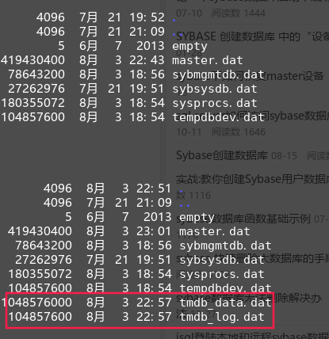
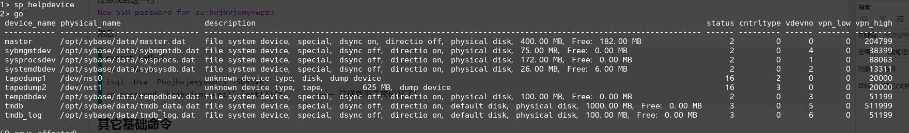

# 基本管理配置
## 登录
命令行执行：  
```shell
cd /opt/sybase
export LANG=C                         
. SYBASE.sh
isql -Usa -PTest1234* -SDBSVR        --- 登录
```

## 启动
记得先 ：export LANG=C  

       --  如果 /opt/SYBASE下面的文件的属主都是root，就不要切换dbuser用户了！！

 首先要切换到dbuser用户，命令：  
 
```shell
su - dbuser   ------- 可能无此用户
. SYBASE.sh   ------- 执行环境变量；
 cd /opt/sybase/ASE-15_0/install/ 
./RUN_DBSVR&       回车；  （---启动主库,要加&）http://zhidao.baidu.com/question/569385907.html  其实和./startserver -f RUN_DBSVR一个作用
./RUN_DBSVR_BAK&     (--启动备份数据库)
```
也可使用命令： 
```
./startserver -f RUN_DBSVR
./startserver -f RUN_DBSVR_BAK
``` 

## 查看数据库是否起来
1. 可以使用：ps –ef|grep sybase查看也可以执行  
2. 也可用：  

```shell
cd /opt/sybase/ASE-15_0/install
./showserver
```

## 停止
执行命令：  

```shell
SYBASE.sh
isql -Usa –Pchangeme123 -SDBSVR
select * from sysservers                   --查找备份数据库的实例名；
go
shutdown SYB_BACKUP                        --SYB_BACKUP是备份数据库的名称
go
shutdown
go
```

----

## 添加数据库及设备
### 更改默认设备
为了防止用户数据库被分配到数据库系统主设备 master 上，应该在安装完数 据库后修改默认设备—安装完 sybase ASE 后，master 是唯一的默认设备。Sybase 建议，master 设备只应该提供给系统数据 库而不是用户数据库。因此，对于用户数据库，我们应当单独创建设备，并且把用户设备设置成默认状态。  
比如我们可能要建立几个用户数据库设备：tmdb,tmdblog  
首先我们需要先取消master的默认设备：  
```
sp_diskdefault "master","defaultoff"
go
(return status = 0)
```


### 添加数据库设备
1. 添加数据库设备及对应日志设备:  

```
disk init
name="tmdb",
physname="/opt/sybase/data/tmdb_data.dat",
size="1000M"
go
disk init
name="tmdb_log",
physname="/opt/sybase/data/tmdb_log.dat",
size="100M"
go
```
可对应的从数据库data目录中查看新增的设备:  


给设备重置空间的命令如下:  

```
disk resize name='tmdb',size='500M'
alter database tmdb on tmdb='500M'
 
disk resize name='tmdb_log',size='50M'
alter database tmdb log on tmdb_log='50M'
```

2. 创建数据库:
```
1> create database tmdb
2> on tmdb="1000M"
3> log on tmdb_log="100M"
4> go
CREATE DATABASE: allocating 256000 logical pages (1000.0 megabytes) on disk 'tmdb' (256000 logical pages requested).
CREATE DATABASE: allocating 25600 logical pages (100.0 megabytes) on disk 'tmdb_log' (25600 logical pages requested).
Processed 110 allocation unit(s) out of 1100 units (allocation page 269056). 10% completed.
Processed 220 allocation unit(s) out of 1100 units (allocation page 30464). 20% completed.
Processed 330 allocation unit(s) out of 1100 units (allocation page 58624). 30% completed.
Processed 440 allocation unit(s) out of 1100 units (allocation page 86784). 40% completed.
Processed 550 allocation unit(s) out of 1100 units (allocation page 114944). 50% completed.
Processed 660 allocation unit(s) out of 1100 units (allocation page 143104). 60% completed.
Processed 770 allocation unit(s) out of 1100 units (allocation page 171264). 70% completed.
Processed 880 allocation unit(s) out of 1100 units (allocation page 199424). 80% completed.
Processed 990 allocation unit(s) out of 1100 units (allocation page 227584). 90% completed.
Processed 1100 allocation unit(s) out of 1100 units (allocation page 255744). 100% completed.
Database 'tmdb' is now online.
```

### 启用tmdb为默认数据库设备
```
1> sp_diskdefault "tmdb","defaulton"    
2> go
(return status = 0)
1> sp_diskdefault "tmdb_log","defaulton"
2> go
(return status = 0)
```

## 删除数据库及设备
删除数据库，不像删除表那样直接drop掉就好了，我们需要查到数据库建立时，数据和日志的存储位置，一并删除才可以，步骤如下：  
1. 查看数据库设备空间使用情况：
```
sp_helpdevice
```



2. 删除设备  
```　　
sp_dropdevice 'tmdb'
go
sp_dropdevice 'tmdb_log'
go
```

3. 删除数据库：
```
drop database tmdb
go
```
----

## 基本表操作
### 创建表
```
create table firstTbl (ID int,name varchar(900),time varchar(30))
go
```
### 删除表
```
drop table firstTbl
go
```
### 清表
```
truncate table firstTbl
go
```
### 批量插入测试数据
创建sql文件createTable.sql,内容如下:  
```sql
use tmdb
go
create table tbl_first (ID int,name varchar(100),time varchar(30))
go
declare @i int, @time char(30)
set @i =380000, @time =convert(char(30), getdate(), 9)
print @time
while @i<1000001
	begin
		print 'start 2'
		insert into tbl_first
		values(@i,'test'+convert(varchar, @i), convert(char(30), getdate(), 9))
		set @i = @i+1
		-- waitfor delay "00:00:01"
		print 'end 2'
	end
	print 'end 1'
go
```
然后以入参形式输入上方sql文件来批量插入数据:  
```
isql -Usa -SDBSVR -PChangeme_123 -i ../../createTable.sql -o./a.txt
```

## 忘记sa密码&修改sa密码

[参考学习链接：](http://www.cnblogs.com/poleax81/archive/2006/06/17/428054.html)  

在/opt/sybase/ASE-15_0/install/RUN_DBSVR最后面(不能加在第一行后面)加上行 -psa  
执行  
```shell
./startserver -f RUN_DBSVR
```
注意找到这一行：  
`New SSO password for sa:bojhvjemyvwpz3`

然后：  

```shell
export LANG=C
su - dbuser
isql -Usa -Pbojhvjemyvwpz3 -SDBSVR
sp_password 'bojhvjemyvwpz3',Test1234*　　　　———— 这样就重置密码好了！
```
 
## 其它基础命令
### 查看配置信息 
sp_configure 'con'   
>
>Parameter Name Default Memory Used  
>config Value Run Value Unit   
>Type
>

sp_helpdb                          —— 查看所有数据库状态  
sp_helpdb dbname            —— 查看某个数据库状态  
sp_who                              —— 查看执行中的业务状态  

## 数据库日志
**日志路径：**  
sybase/ASE-15_0/install/DBSVR.log   

出现The transaction log in database tempdb is almost full.  Your transaction is being suspended until space is made available in the log.  
执行  

2> dump transaction with truncate_only  
3> go  
Msg 156, Level 15, State 2:  
Server 'DBSVR', Line 2:  
Incorrect syntax near the keyword 'with'.  —— 郁闷，奇怪， 我是按照网上来的  

1> dump transaction OMSSM with no_log  
2> go
