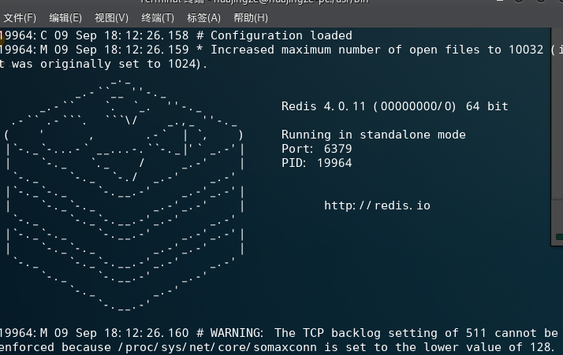
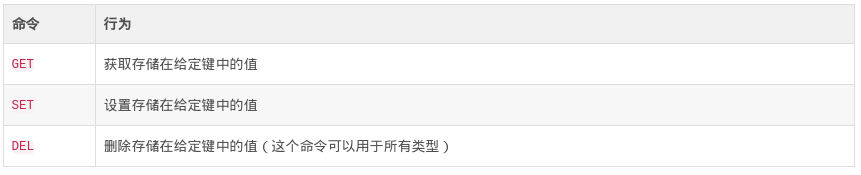
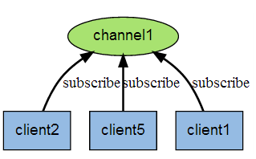
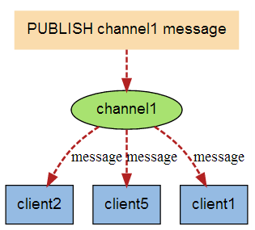

# redis简介
# redis简介
## 简介
Redis 是Remote Dictionary Server（远程字典服务器）的缩写，是一个开源的高性能键值对数据库，它提供多种键值数据类型来适应不同场景下的存储需求，并借助许多高层级的接口能够胜任如缓存、队列系统等不同的角色。
Redis是一款开源的，基于BSD许可的，高级键值(key-value)缓存(cache)和存储(store)系统，属于nosql、数据结构型服务器。  


### 支持的数据结构 
Redis最为常用的数据类型主要有以下： 
-   String
-   Hash
-   List
-   Set
-   Sorted set
-   pub/sub
-   Transactions

这些数据类型都支持push/pop、add/remove及取交集并集和差集及更丰富的操作，而且这些操作都是原子性的。在此基础上，redis支持各种不同方式的排序。为了保证效率，数据都是缓存在内存中。
优点：周期性的把更新的数据写入磁盘或者把修改操作写入追加的记录文件，并且在此基础上实现了master-slave(主从)同步。 

### redis的特性
* 1. 速度快，数据放在内存中，官方给出的读写性能10万/S，与机器性能也有关  
　　a. 数据放内存中是速度快的主要原因  
　　b. C语言实现，与操作系统距离近   
　　c. 使用了单线程架构，预防多线程可能产生的竞争问题  
* 2. 键值对的数据结构服务器  
* 3. 丰富的功能：键过期，发布订阅，事务，流水线.....  
* 4. 简单稳定：单线程  
* 5. 持久化：发生断电或机器故障，数据可能会丢失，持久化到硬盘  
* 6. 主从复制：实现多个相同数据的redis副本  
* 7. 高可用和分布式：哨兵机制实现高可用，保证redis节点故障发现和自动转移  
* 8. 客户端语言多：java php python c c++ nodejs等  

---
## 配置
### 持久化

redis提供了两种持久化的方式，分别是RDB（Redis DataBase）和AOF（Append Only File）。  
RDB，简而言之，就是在不同的时间点，将redis存储的数据生成快照并存储到磁盘等介质上；  
AOF，则是换了一个角度来实现持久化，那就是将redis执行过的所有写指令记录下来，在下次redis重新启动时，只要把这些写指令从前到后再重复执行一遍，就可以实现数据恢复了。  
其实RDB和AOF两种方式也可以同时使用，在这种情况下，如果redis重启的话，则会优先采用AOF方式来进行数据恢复，这是因为AOF方式的数据恢复完整度更高。  
如果你没有数据持久化的需求，也完全可以关闭RDB和AOF方式，这样的话，redis将变成一个纯内存数据库，就像memcache一样。  
 
#### 1.redis持久化 – RDB

RDB方式，是将redis某一时刻的数据持久化到磁盘中，是一种快照式的持久化方法。  
redis在进行数据持久化的过程中，会先将数据写入到一个临时文件中，待持久化过程都结束了，才会用这个临时文件替换上次持久化好的文件。正是这种特性，让我们可以随时来进行备份，因为快照文件总是完整可用的。  
对于RDB方式，redis会单独创建（fork）一个子进程来进行持久化，而主进程是不会进行任何IO操作的，这样就确保了redis极高的性能。  
如果需要进行大规模数据的恢复，且对于数据恢复的完整性不是非常敏感，那RDB方式要比AOF方式更加的高效。  
虽然RDB有不少优点，但它的缺点也是不容忽视的。如果你对数据的完整性非常敏感，那么RDB方式就不太适合你，因为即使你每5分钟都持久化一次，当redis故障时，仍然会有近5分钟的数据丢失。所以，redis还提供了另一种持久化方式，那就是AOF  

RDB方式对应的配置项如下：
``` shell 
#save ""
save 900 1
save 300 10
save 60 10000
```
* save ""： 表示开启RDB方式，默认情况下是未开启；  
* save 900 1：表示900秒内至少有一个Key发生变化即触发一次持久化；  
* save 300 10：表示300秒内至少有10个Key发生变化即触发一次持久化；  
* save 60 1：表示60秒内至少有10000个Key发生变化即触发一次持久化；  


#### 2.redis持久化 – AOF

AOF，英文是Append Only File，即只允许追加不允许改写的文件。  
如前面介绍的，AOF方式是将执行过的写指令记录下来，在数据恢复时按照从前到后的顺序再将指令都执行一遍，就这么简单。  
我们通过配置redis.conf中的appendonly yes就可以打开AOF功能。如果有写操作（如SET等），redis就会被追加到AOF文件的末尾。  
\-\- 默认的AOF持久化策略是每秒钟fsync一次（fsync是指把缓存中的写指令记录到磁盘中），因为在这种情况下，redis仍然可以保持很好的处理性能，即使redis故障，也只会丢失最近1秒钟的数据。  
如果在追加日志时，恰好遇到磁盘空间满或断电等情况导致日志写入不完整，也没有关系，redis提供了redis-check-aof工具，可以用来进行日志修复。  
因为采用了追加方式，如果不做任何处理的话，AOF文件会变得越来越大，为此，redis提供了AOF文件重写（rewrite）机制，即当AOF文件的大小超过所设定的阈值时，redis就会启动AOF文件的内容压缩，只保留可以恢复数据的最小指令集。举个例子或许更形象，假如我们调用了100次INCR指令，在AOF文件中就要存储100条指令，但这明显是很低效的，完全可以把这100条指令合并成一条SET指令，这就是重写机制的原理。  
在进行AOF重写时，仍然是采用先写临时文件，全部完成后再替换的流程，所以断电、磁盘满等问题都不会影响AOF文件的可用性，这点大家可以放心。  
AOF方式的另一个好处，我们通过一个“场景再现”来说明。某同学在操作redis时，不小心执行了FLUSHALL，导致redis内存中的数据全部被清空了，这是很悲剧的事情。不过这也不是世界末日，只要redis配置了AOF持久化方式，且AOF文件还没有被重写（rewrite），我们就可以用最快的速度暂停redis并编辑AOF文件，将最后一行的FLUSHALL命令删除，然后重启redis，就可以恢复redis的所有数据到FLUSHALL之前的状态了。是不是很神奇，这就是AOF持久化方式的好处之一。但是如果AOF文件已经被重写了，那就无法通过这种方法来恢复数据了。  
虽然优点多多，但AOF方式也同样存在缺陷，比如在同样数据规模的情况下，AOF文件要比RDB文件的体积大。而且，AOF方式的恢复速度也要慢于RDB方式。  
如果你直接执行BGREWRITEAOF命令，那么redis会生成一个全新的AOF文件，其中便包括了可以恢复现有数据的最少的命令集。  
如果运气比较差，AOF文件出现了被写坏的情况，也不必过分担忧，redis并不会贸然加载这个有问题的AOF文件，而是报错退出。这时可以通过以下步骤来修复出错的文件：  
a.备份被写坏的AOF文件  
b.运行redis-check-aof –fix进行修复  
c.用diff -u来看下两个文件的差异，确认问题点  
d.重启redis，加载修复后的AOF文件  
AOF重写的内部运行原理，我们有必要了解一下。  
在重写即将开始之际，redis会创建（fork）一个“重写子进程”，这个子进程会首先读取现有的AOF文件，并将其包含的指令进行分析压缩并写入到一个临时文件中。  
与此同时，主工作进程会将新接收到的写指令一边累积到内存缓冲区中，一边继续写入到原有的AOF文件中，这样做是保证原有的AOF文件的可用性，避免在重写过程中出现意外。  
当“重写子进程”完成重写工作后，它会给父进程发一个信号，父进程收到信号后就会将内存中缓存的写指令追加到新AOF文件中。  
当追加结束后，redis就会用新AOF文件来代替旧AOF文件，之后再有新的写指令，就都会追加到新的AOF文件中了。  

AOF方式对应的配置项如下：
```shell
appendonly yes 
# appendfsync always
appendfsync everysec
# appendfsync no
```
* appendonly yes：表示开启AOF方式，默认情况下即开启AOF；
* appendfsync always：一有变更就写入，默认关闭；
* appendfsync everysec：每秒记录一次，将数据从内存从刷到磁盘去；
* appendfsync no：每隔一段时间，根据系统的算法，Linux系统不定期把内存的数据同步到磁盘上去，根据这个频率走，容易丢数据；

---

### 主从

像MySQL一样，redis是支持主从同步的，而且也支持一主多从以及多级从结构。  
主从结构，一是为了纯粹的冗余备份，二是为了提升读性能，比如很消耗性能的SORT就可以由从服务器来承担。  
redis的主从同步是异步进行的，这意味着主从同步不会影响主逻辑，也不会降低redis的处理性能。  
主从架构中，可以考虑关闭主服务器的数据持久化功能，只让从服务器进行持久化，这样可以提高主服务器的处理性能。  
在主从架构中，从服务器通常被设置为只读模式，这样可以避免从服务器的数据被误修改。但是从服务器仍然可以接受CONFIG等指令，所以还是不应该将从服务器直接暴露到不安全的网络环境中。如果必须如此，那可以考虑给重要指令进行重命名，来避免命令被外人误执行。  
   
<font color=#00A5A5A5 >同步原理</font>：  
在BGSAVE指令执行完成后，主服务器会将持久化好的RDB文件发送给从服务器，从服务器接到此文件后会将其存储到磁盘上，然后再将其读取到内存中。这个动作完成后，主服务器会将这段时间缓存的写指令再以redis协议的格式发送给从服务器。  
另外，要说的一点是，即使有多个从服务器同时发来SYNC指令，主服务器也只会执行一次BGSAVE，然后把持久化好的RDB文件发给多个下游。在redis2.8版本之前，如果从服务器与主服务器因某些原因断开连接的话，都会进行一次主从之间的全量的数据同步；而在2.8版本之后，redis支持了效率更高的增量同步策略，这大大降低了连接断开的恢复成本。  
主服务器会在内存中维护一个缓冲区，缓冲区中存储着将要发给从服务器的内容。从服务器在与主服务器出现网络瞬断之后，从服务器会尝试再次与主服务器连接，一旦连接成功，从服务器就会把“希望同步的主服务器ID”和“希望请求的数据的偏移位置（replication offset）”发送出去。主服务器接收到这样的同步请求后，首先会验证主服务器ID是否和自己的ID匹配，其次会检查“请求的偏移位置”是否存在于自己的缓冲区中，如果两者都满足的话，主服务器就会向从服务器发送增量内容。  
增量同步功能，需要服务器端支持全新的PSYNC指令。这个指令，只有在redis-2.8之后才具有。  

<font color=#00A5A5A5 >配置示例</font>：  
redis的主从和mysql主从类似，但是配置起来比mysql要简单。
两台机器的IP： 192.168.222.111 （主） 192.168.222.112 （从） 
* 1.两台机器都关闭所有的防火墙。 
* 2.如果你的两台机器都只监听了127.0.0.1这个本地ip的话，需要先添加能够访问外网的ip：  
```shell
bind 192.168.222.111  //主机配置文件redis.conf，主机上绑定主机IP

bind 192.168.222.111  //从机配置文件redis.conf，从机上绑定从机IP
```

* 3.配置主从，编辑 从（slave） 上的redis配置文件：  
```shell
slaveof 192.168.222.111 6379
```
* 4.t重启从机的radis：  
```shell
killall redis-server
redis-server /etc/redis.conf
```

### redis集群介绍

redis cluster（redis集群）是redis3.0之后的版本才支持的架构，和其他集群一样，redis集群也是为了解决单台服务器不够用的情况。redis cluster是一个分布式的集群方案，它支持横向扩展。redis的集群方案不单止官方的redis cluster，还有第三方的Codis集群方案。Codis类似于LVS做负载均衡一样，它用的是路由的技术。而官方的redis cluster则是把所有的节点都互联，实现数据共享。

redis cluster集群的特点：


-   多个redis节点网络互联，数据共享
-   所有的节点都是一主一从（可以是多个从），其中从不提供服务，仅作为备用
-   不支持同时处理多个键（如mset/mget），因为redis需要把键均匀分布在各个节点上，并发量很高的情况下同时创建键值会降低性能并导致不可预测的行为。
-   支持在线增加、删除节点
-   客户端可以连任何一个主节点进行读写

### 工具及常用命令  
**工具**：  
redis-benchmark：Redis性能测试工具，测试Redis在你的系统及你的配置下的读写性能  
redis-cli：Redis命令行操作工具。  
redis-server：Redis服务器的daemon启动程序  
redis-check-dump：用于修复出问题的dump.rdb文件  
redis-check-aof：用于修复出问题的AOF文件 

**常用命令**：  
1.set key value  
2.get key  
3.del key1、key2、key3  
4.flushdb 删除当前数据库中的所有Key  
 flushall  删除所有数据库中的key  
5.exists key 判断key值是否存在，存在返回1  
6.expire key seconds 设置过期时间    TTL key 查看过期时间，  
7.persist key 移除给定key的过期时间  
8.select 0/1  切换redis数据库 默认0  
9.move key db（0/1） 将当前数据库的 key 移动到给定的数据库 db 当中  
10.#redis-cli keys  dbsize 统计有多少key值  
11.#redis-cli keys '*'    查看说有key值


### redis的适用/不适用场景 
**适用场景**
* 1. 缓存：因为读写速度快，通过合理使用缓存加快数据访问速度，降低后端数据源压力  
* 2. 排行榜：redis提供了列表和有序集合的数据结构，而内部也建立了针对的机制。比如要读取某一个列表的总数，传统的数据库会去遍历，而redis取值就可以了。他的列表和有序集合也适合做排行榜。  
* 3. 计数器应用：有时会大量用到计数器，比如视频网站的播放量、网站的浏览数。redis内置的部分机制会使得这种操作时间复杂度非常小。   
* 4. 社交网络：下拉刷新、按喜好推送等社交网络上的功能，对网站的访问量非常大，传统的关系型数据库不适合保持这类数据，redis提供的数据结构相对比较容易实现。    
* 5. 消息队列：发布和订阅  

**不适用场景**  
* 1. 冷数据：对于一些记录，比如视频网站中用户的播放记录，这些记录相对视频信息会冷上不少。这样的数据放在内存中是比较浪费的。   
* 2. 复杂查询：nosql在复杂查询方面比不上传统的数据库。  

---

## 基本使用  

执行命令redis-server /etc/redis.conf启动，成功时截图如下：



### 命令行使用
#### string类型  
string为最简单的类型，与Memcached一样的类型，一个key对应一个value，其支持的操作与Memcached的操作类似，它的功能更丰富。设置可以存二进制的对象

```shell
[huajingze@huajingze-pc bin]$ redis-cli
127.0.0.1:6379> keys *
(empty list or set)
127.0.0.1:6379> set alarm "Great team"
OK
127.0.0.1:6379> get alarm
"Great team"
127.0.0.1:6379> mset k1 a k2 b
OK
127.0.0.1:6379> get k2
"b"
127.0.0.1:6379> mget k2
1) "b"
127.0.0.1:6379> mget k1 k2 alarm
1) "a"
2) "b"
3) "Great team"
```  


#### list 类型 
list是一个链表结构，主要功能是push、pop、获取一个范围的所有值等等。操作中key理解为链表的名字
使用 list 结构，我们可以轻松地实现最新消息排行等功能（比如新浪微博的 TimeLine ）。list 的另一个应用就是消息队列，可以利用 list 的 push操作，将任务存在 list 中，然后工作线程再用pop操作将任务取出进行执行。
```shell
127.0.0.1:6379> lpush listTest "a"
(integer) 1
127.0.0.1:6379> lpush listTest "b"
(integer) 2
127.0.0.1:6379> lpush listTest "c"
(integer) 3
127.0.0.1:6379> lrange listTest 0 -1
1) "c"
2) "b"
3) "a"
127.0.0.1:6379> lrange listTest 0 1
1) "c"
2) "b"
127.0.0.1:6379> lpop listTest
"c"
127.0.0.1:6379> lrange listTest 0 1
1) "b"
2) "a"
```  

#### set 类型 
set是集合，和我们数学中的集合概念相似，对集合的操作有添加删除元素，有对多个集合求交并差等操作。操作中key理解为集合的名字
比如在微博应用中，可以将一个用户所有的关注人存在一个集合中，将其所有粉丝存在一个集合。因为 Redis 非常人性化的为集合提供了求交集、并集、差集等操作，那么就可以非常方便的实现如共同关注、共同喜好、二度好友等功能，对上面的所有集合操作，你还可以使用不同的命令选择将结果返回给客户端还是存集到一个新的集合中。  
```shell
127.0.0.1:6379> lrange listTest 0 1
1) "b"
2) "a"
127.0.0.1:6379> sadd setTest a
(integer) 1
127.0.0.1:6379> sadd setTest b
(integer) 1
127.0.0.1:6379> sadd setTest c
(integer) 1
127.0.0.1:6379> sadd setTest d e f
(integer) 3
127.0.0.1:6379> SMEMBERS setTest
1) "d"
2) "b"
3) "a"
4) "e"
5) "c"
6) "f"
```

<font color=#00A5A5A5 >并集</font>：就是去掉两个集合中相同的元素，简单来说就是去重  
```shell
127.0.0.1:6379> sadd setTest2 a b c 1 2 3
(integer) 6
127.0.0.1:6379> SUNION setTest setTest2
1) "a"
2) "e"
3) "d"
4) "b"
5) "c"
6) "f"
7) "2"
8) "1"
9) "3"
```

<font color=#00A5A5A5 >交集</font>：就是把两个集合中相同的元素打印出来  
```shell
127.0.0.1:6379> SINTER setTest setTest2
1) "b"
2) "a"
3) "c"
```

<font color=#00A5A5A5 >差集</font>：就是以集合A减去集合B剩余的  
```shell
127.0.0.1:6379> SDIFF setTest setTest2
1) "e"
2) "f"
3) "d"
```

<font color=#00A5A5A5 >删除元素</font>：  
```shell
127.0.0.1:6379> SREM setTest a
(integer) 1
127.0.0.1:6379> SMEMBERS setTest
1) "e"
2) "b"
3) "d"
4) "c"
5) "f"
127.0.0.1:6379> SREM setTest b c
(integer) 2
127.0.0.1:6379> SMEMBERS setTest
1) "e"
2) "d"
3) "f"
```

#### sorted set 类型
sorted set是有序集合，它比set多了一个权重参数score，使得集合中的元素能够按 score 进行有序排列
比如一个存储全班同学成绩的 Sorted Sets，其集合 value 可以是同学的学号，而 score 就可以是其考试得分，这样在数据插入集合的时候，就已经进行了天然的排序。  
```shell
127.0.0.1:6379> zadd setTest3 1 "aa"                                                        #创建一个名为setTest3的有序集合，放入权值为1的 对象 aa
(integer) 1
127.0.0.1:6379> zadd setTest3 2 "bb" 3 "cc"
(integer) 2
127.0.0.1:6379> zrange setTest3 0 -1                                                        #升序打印所有对象
1) "aa"
2) "bb"
3) "cc"
127.0.0.1:6379> zrevrange setTest3 0 -1                                                  #逆序打印所有对象
1) "cc"
2) "bb"
3) "aa"
```

#### hash类型 
将一些结构化的信息打包成 hashmap，在客户端序列化后存储为一个字符串的值（一般是 JSON 格式），比如用户的昵称、年龄、性别、积分等。  
```shell
127.0.0.1:6379> HSET hashTest name johnGreen                                      #创建一个名为hashTest的hash，键为name，值为johnGreen 
(integer) 1
127.0.0.1:6379> HSET hashTest age 28
(integer) 1
127.0.0.1:6379> HSET hashTest job IT
(integer) 1
127.0.0.1:6379> HGET hashTest name
"johnGreen"
127.0.0.1:6379> HGETALL hashTest                                                             #获取所有值
1) "name"
2) "johnGreen"
3) "age"
4) "28"
5) "job"
6) "IT"
```

#### pub/sub
redis发布与订阅(pub/sub)是它的一种消息通信模式，一方发送信息，一方接收信息。  
下图是三个客户端同时订阅同一个频道：  


下图是有新信息发送给频道1时，就会将消息发送给订阅它的三个客户端：  



### java 上基本使用  
客户端代码：
```java
    private  static Jedis jedis = new Jedis("127.0.0.1",6379);;
    public static void main(String[] args)
    {
        System.out.println(jedis.ping());
        handleString();
        handleList();
        handleSet();
        handleSortedSet();
        handleHash();
    }
```

<font color=#00A5A5A5 >string类型</font>：
```java
    private static void handleString()
    {
        System.out.println(jedis.get("alarm"));
        jedis.set("alarm", "Fault client, Great team");
        System.out.println(jedis.get("alarm"));
    }

结果：
PONG
Great team
Fault client, Great team
```

<font color=#00A5A5A5 >list类型</font>：
```java
    private static void handleList()
    {
        System.out.println(jedis.lrange("listTest", 0, -1));
        jedis.rpush("listTest", "aa");
        System.out.println(jedis.lrange("listTest", 0, -1));
    }
 结果：
PONG
[b, a, aa]
[b, a, aa, aa]
```

<font color=#00A5A5A5 >set类型</font>：
```java
    private  static  void handleSet()
    {
        System.out.println(jedis.smembers("setTest"));
        jedis.sadd("setTest", "galang", "john");
        System.out.println(jedis.smembers("setTest"));
        System.out.println(jedis.sunion("setTest", "setTest2"));
    }
结果：
PONG
[e, d, f]
[e, d, john, f, galang]
[c, john, f, galang, b, 1, e, a, d, 2, 3]    
```

<font color=#00A5A5A5 >sorted set类型</font>：
```java
    private static void handleSortedSet()
    {
        System.out.println(jedis.zrange("setTest3", 0, -1));
        jedis.zadd("setTest3", 4, "dd");
        System.out.println(jedis.zrange("setTest3", 0, -1));
        System.out.println(jedis.zrevrange("setTest3", 0, -1));
    }
结果：
PONG
[aa, bb, cc]
[aa, bb, cc, dd]
[dd, cc, bb, aa]
```

<font color=#00A5A5A5 >hash类型</font>：
```java
    private static void handleHash()
    {
        System.out.println(jedis.hgetAll("hashTest"));
    }
结果：
PONG
{name=johnGreen, job=IT, age=28}
```


**mark**:  
https://blog.csdn.net/xou6363/article/details/82079949  
https://blog.csdn.net/guowenwen_0416/article/details/52778468  
https://blog.csdn.net/liqingtx/article/details/60330555  
https://blog.csdn.net/middleware2018/article/details/80355418  
https://blog.csdn.net/hjm4702192/article/details/80518856  
https://www.cnblogs.com/mrhgw/p/6278619.html


